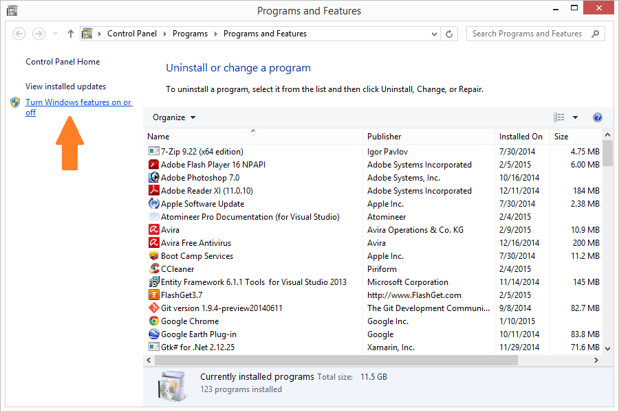
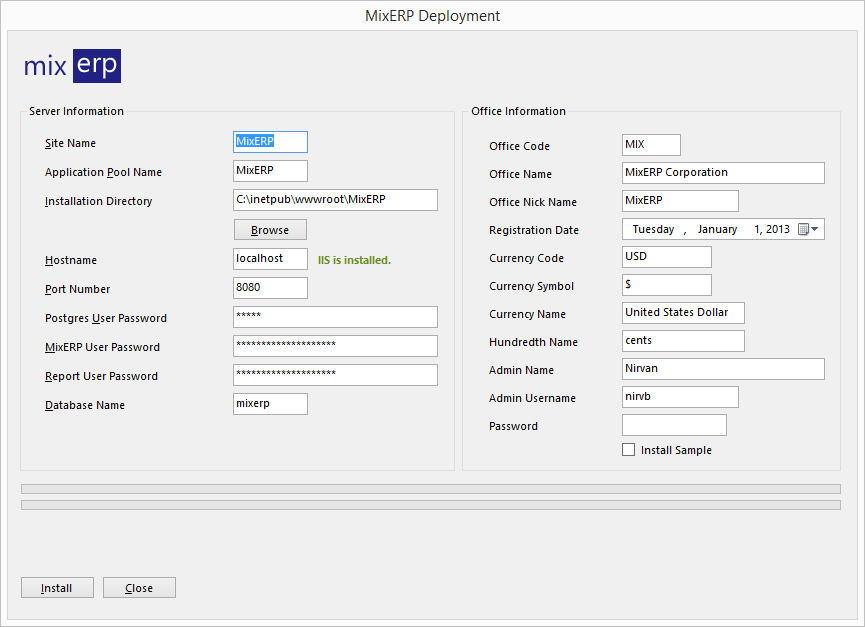

#MixERP Deployment Utility (Installer)

MixERP Deployment Utility can be downloaded from [GitHub](https://github.com/mixerp/mixerp/releases/)
or [Codeplex](https://mixerp.codeplex.com/releases/). The installer includes:

* PostgreSQL Server 9.4.1 32-bit
* PostgreSQL Server 9.4.1 64-bit
* MixERP Application

We have tested the utility on the following platforms:

* Windows 7 32-bit
* Windows 7 64-bit
* Windows 8/8.1 32-bit
* Windows 8/8.1 64-bit

##Install IIS on Windows First

Before you start the deployment utility, please make sure that you have already installed IIS. To install
IIS, go to run, and type: "AppWiz.cpl"



Now, click on the link "Turn Windows features on or off".


Check "Internet Information Services" on, and click OK.

##Restart Windows

After installing IIS, restart Microsoft Windows.

##Launch MixERP Deployment Utility

Run the executable file <strong>"MixERP.Net.Utility.Installer.exe"</strong> as administrator.




Everything in this form is required. Fill-up the details and click install.

##MixERP Application Website

<table>
    <tr>
        <td>
            Site Name
        </td>
        <td>
            Name of the site which will be created on IIS.
        </td>
    </tr>
    <tr>
        <td>
            Application Pool Name
        </td>
        <td>
            Name of the Application Pool on which your site will run.
        </td>
    </tr>
    <tr>
        <td>
            Installation Directory
        </td>
        <td>
            The target directory where your MixERP application site is going to be installed to.
        </td>
    </tr>
    <tr>
        <td>
            Browse Button
        </td>
        <td>
            This would help you find your installation directory by opening a modal directory browser window.
        </td>
    </tr>
    <tr>
        <td>
            Hostname
        </td>
        <td>
            Windows NetBIOS Name, IP Address, or DNS name of your MixERP application website. You will need this
            information in order to access MixERP. If you are unsure about this or do not have
            a DNS name, leave the field to localhost.
        </td>
    </tr>
    <tr>
        <td>
            Port Number
        </td>
        <td>
            The port number to bind MixERP website to. A hostname and port number, together, form a URL (Uniform
            Resource Locator) to access MixERP application website.
        </td>
    </tr>
</table>

##MixERP PostgreSQL Database

<table>
    <tr>
        <td>
            Postgres User Password
        </td>
        <td>
            The default superuser account for PostgreSQL Server on Windows and some Linux operating systems
            is "postgres". Since, your new PostgreSQL Server instance is being installed by MixERP
            Deployment Utility, provide a new password for "postgres" account. This password cannot be recovered.
        </td>
    </tr>
    <tr>
        <td>
            MixERP User Password
        </td>
        <td>
            The PostgreSQL role "mix_erp" is used by MixERP application to access the database. We do not need
            "postgres" account. Provide a new password for "mix_erp" PostgreSQL role. This password will be stored
            in application configuration file.
        </td>
    </tr>
    <tr>
        <td>
            Report User Password
        </td>
        <td>
            The PostgreSQL role "report_user" is used by MixERP Reporting Engine to access the database.
            This user **must have a read-only access** to the database. This password will be stored
            in application configuration file.
        </td>
    </tr>
    <tr>
        <td>
            Database Name
        </td>
        <td>
            Provide a database name that does not exist (if you happen to run this installer after installing
            PostgreSQL server). A new database with the provided name will be created. Please also note that
            MixERP database uses "template0" database, along with "C/POSIX" locale and "UTF8" encoding.
        </td>
    </tr>
</table>

<div class="alert-box warn radius">
    <p>
        Please make absolutely sure that you provide a secure password here. PostgreSQL is one of
        the best modern database management systems with built-in rich security features. But
        that would not make your PostgreSQL installation secure by default. You would find various tutorials about
        securing your PostgreSQL instance on the internet. Some of which are:
    </p>

    <ul>
        <li>
            <a href="http://www.ibm.com/developerworks/library/os-postgresecurity/" target="_blank">http://www.ibm.com/developerworks/library/os-postgresecurity/</a>
        </li>
        <li>
            <a href="http://www.depesz.com/2007/08/18/securing-your-postgresql-database/" target="_blank">http://www.depesz.com/2007/08/18/securing-your-postgresql-database/</a>
        </li>
        <li>
            <a href="http://www.mad-hacking.net/documentation/linux/applications/postgres/connection-permissions.xml" target="_blank">http://www.mad-hacking.net/documentation/linux/applications/postgres/connection-permissions.xml</a>
        </li>
        <li>
            <a href="http://dbaportal.eu/2013/11/11/securing-postgresql/" target="_blank">http://dbaportal.eu/2013/11/11/securing-postgresql/</a>
        </li>
    </ul>
</div>


##Create Your First Office in MixERP

<table>
    <tr>
        <td>
            Office Code
        </td>
        <td>
            A short, easy-to-remember code given to your office or "office group".
        </td>
    </tr>
    <tr>
        <td>
            Office Name
        </td>
        <td>
            Name of your establishment or office group. For example, ABC Corporation, EU.
            The ABC Corporation, EU might not actually be an office, but it can contain offices around Europe as children.
            MixERP supports unlimited hierarchies on establishments. Using this feature will help you
            generate consolidated reports on any level.
        </td>
    </tr>
    <tr>
        <td>
            Office Nick Name
        </td>
        <td>
            Nick name of your establishment or office group.
        </td>
    </tr>
    <tr>
        <td>
            Registration Date
        </td>
        <td>
            Date of registration of your establishment.
        </td>
    </tr>
    <tr>
        <td>
            Currency Code
        </td>
        <td>
            The home currency code of your establishment. Please make sure that the currency code you provide
            here is a three-letter ISO currency code.
        </td>
    </tr>
    <tr>
        <td>
            Currency Name
        </td>
        <td>
            The name of your home currency in your language.
        </td>
    </tr>
    <tr>
        <td>
            Hundredth Name
        </td>
        <td>
            The hundredth name of your home currency.
        </td>
    </tr>
    <tr>
        <td>
            Admin Username
        </td>
        <td>
            Provide a username for the first MixERP administrative user that will be created.
        </td>
    </tr>
    <tr>
        <td>
            Password
        </td>
        <td>
            Password for the MixERP administrator.
        </td>
    </tr>
</table>


##Default Configuration Values

The default configuration values shown by the installer can be edited on the configuration file:

<strong>
    MixERP.Net.Utility.Installer.exe.config
</strong>


```xml
<?xml version="1.0" encoding="utf-8" ?>
<configuration>
    <startup>
        <supportedRuntime version="v4.0" sku=".NETFramework,Version=v4.5.1" />
    </startup>
    <appSettings>
        <add key="SiteName" value="MixERP"/>
        <add key="AssetsDirectory" value="Assets" />
        <add key="PostgreSQLInstallerDirectory" value="Assets/PostgreSQL" />
        <add key="PostgreSQLInstallationDirectory" value="C:\Program Files\PostgreSQL\9.4" />
        <add key="DownloadDirectory" value="Temp/Downloads" />
        <add key="ArchiveName" value="v1.1.zip"/>
        <add key="ExtractDirectory" value="Temp/Extracted" />
        <add key="InstallerManifest" value="MixERP.Installation.xml" />
        <add key="PostgresPassword" value="binod" />
        <add key="MixERPPassword" value="change-on-deployment" />
        <add key="ReportUserPassword" value="change-on-deployment" />
        <add key="OfficeCode" value="MIX" />
        <add key="OfficeName" value="MixERP Corporation"/>
        <add key="NickName" value="MixERP"/>
        <add key="RegistrationDate" value="1-1-2013"/>
        <add key="CurrencyCode" value="USD"/>
        <add key="CurrencySymbol" value="$"/>
        <add key="CurrencyName" value="United States Dollar"/>
        <add key="HundredthName" value="cents"/>
        <add key="AdminName" value="Nirvan"/>
        <add key="UserName" value="nirvb"/>
        <add key="InstallSample" value="false" />
    </appSettings>
</configuration>
```


If you have questions, please join any of the following networks. We would love to hear from you:
* [MixERP Forums](http://mixerp.org/forum)
* [MixERP Facebook Page](https://www.facebook.com/mixerp.official/)
* [MixERP Facebook Developers' Group](https://www.facebook.com/groups/mixerp/)


Thank you for your valuable time. We look forward to build an outstanding community.

##Related Topics
* [Deployment Documentation](../admin.md)