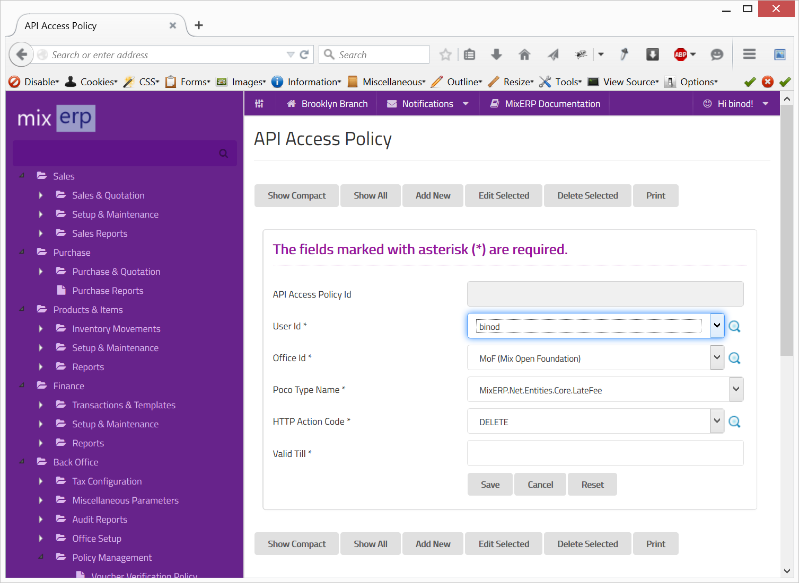

#API Access Policy

API access policy defines the access right of a user, which enables the user to access various MixERP APIs using
HTTTP action codes and verbs.

##Fields

**User Id**

Select the user for which the policy will be in effect.

**Office Id**

Select the office in which the policy will take effect.

**Poco Type Name**

Select the name of the resource which you want to allow access to.

**HTTP Action Code**

Select one of the following HTTP verbs or action codes though which access is allowed:

* DELETE
* GET
* POST
* PUT

**Valid Till**

The date until this policy is valid; thenceforth, having no effect.

    Since this form implements ScrudFactory helper module, the detailed explanation of this feature is not provided
    in this document. View <a href="../../core-concepts/scrud-factory.md">ScrudFactory Helper Module Documentation</a>
    for more information.

##Related Topics
* [Policy Engine](../../core-concepts/policy-engine.md)