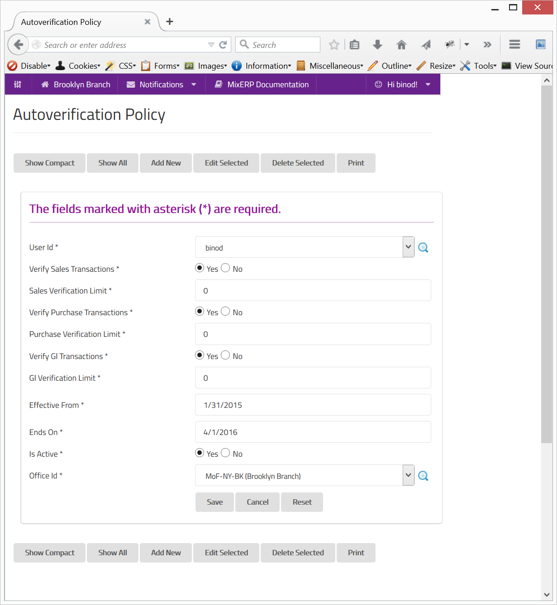

#Automatic Verification Policy

The **sys user** can automatically verify a transaction, provided that you have already configured it to do so.

##Fields

**User Id**

Select the user for which **auto-verification** will be in effect.

**Can Verify Sales Transactions**

Specify whether sales transactions can be verified automatically.

**Sales Verification Limit**

Provide the automatic sales verification limit in base currency for the selected office. Zero (0) means unlimited.

**Can Verify Purchase Transactions**

Specify whether purchase transactions can be verified automatically.

**Purchase Verification Limit**

Provide the automatic purchase verification limit in base currency for the selected office. Zero (0) means unlimited.

**Can Verify GL Transactions**

Specify whether GL transactions can be verified automatically.

**GL Verification Limit**

Provide the automatic GL transaction verification limit in base currency for the selected office. Zero (0) means unlimited.

**Effective From**

The date from which this policy has effect.

**Ends On**

The date on which this policy ends, thus, having no effect.

**Is Active**

Specify whether this policy is active. If this is switched off, the policy has no effect.

**Office Id**

Select the office in which the policy will take effect.

    Since this form implements ScrudFactory helper module, the detailed explanation of this feature is not provided
    in this document. View <a href="../../core-concepts/scrud-factory.md">ScrudFactory Helper Module Documentation</a>
    for more information.

##Related Topics
* [Policy Engine](../../core-concepts/policy-engine.md)