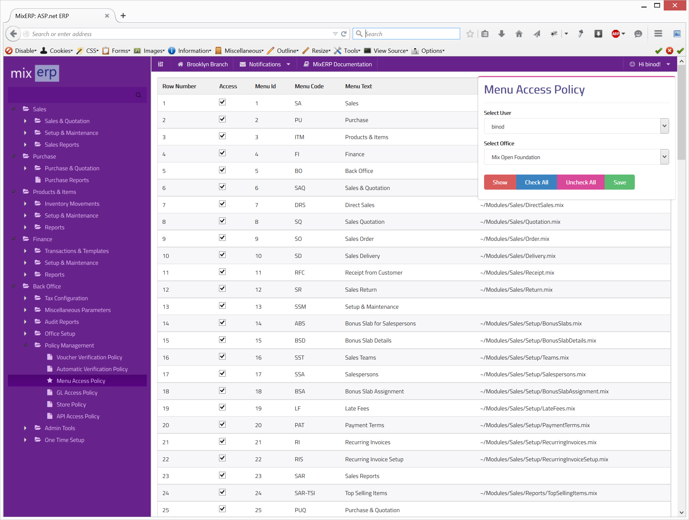

#Menu Access Policy

Menu access policy allows administrators to define access to application menus to the users. The users can 
only access menu items for which they have been granted access to.

If users enter an associated url of a menu directly on the browser address bar 
for which they don't have access policy defined, access will not be granted.

##Fields

**User Id**

Select the user for which the policy will be in effect.

**Office Id**

Select the office in which the policy will take effect.

##Buttons

**Show**

Displays the existing policy of the selected user on the selected office.

**Check All**

Checks all menu items.

**Uncheck All**

Unchecks all menu items.

**Save**

Saves menu policy for the selected user on the selected office.

##Related Topics
* [Policy Engine](../../core-concepts/policy-engine.md)