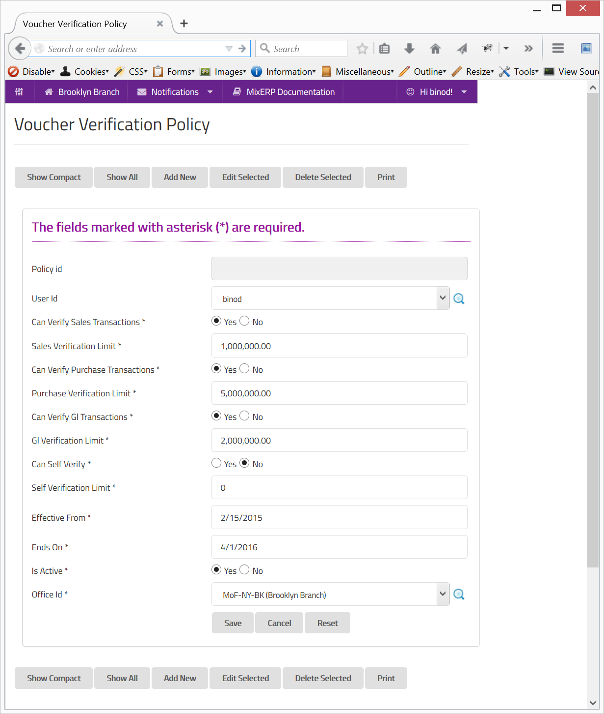

#Voucher Verification Policy

When a transaction is posted to MixERP, it is sent to verification queue. The **Voucher Administrators** can
then verify the transaction. A verified transaction can be either **approved** or **rejected**.

##Fields

**Policy Id**

This is an auto-generated and read-only field.

**User Id**

Select the user for which your creating the policy. The selected user will be a Voucher Administrator.

**Can Verify Sales Transactions**

Specify whether the VA can verify sales transactions.

**Sales Verification Limit**

Provide the sales verification limit in base currency for the selected office. Zero (0) means unlimited.

**Can Verify Purchase Transactions**

Specify whether the VA can verify purchase transactions.

**Purchase Verification Limit**

Provide the purchase verification limit in base currency for the selected office. Zero (0) means unlimited.

**Can Verify GL Transactions**

Specify whether the VA can verify GL transactions.

**GL Verification Limit**

Provide the GL transaction verification limit in base currency for the selected office. Zero (0) means unlimited.

**Can Verify Self**

Specify whether the VA can verify her own transaction. By default, MixERP disallows to verify own transactions
unless you turn this switch on.

**Effective From**

The date from which this policy has effect.

**Ends On**

The date on which this policy ends, thus, having no effect.

**Is Active**

Specify whether this policy is active. If this is switched off, the policy has no effect.

**Office Id**

Select the office in which the policy will take effect.

    Since this form implements ScrudFactory helper module, the detailed explanation of this feature is not provided
    in this document. View <a href="../../core-concepts/scrud-factory.md">ScrudFactory Helper Module Documentation</a>
    for more information.

##Related Topics
* [Policy Engine](../../core-concepts/policy-engine.md)