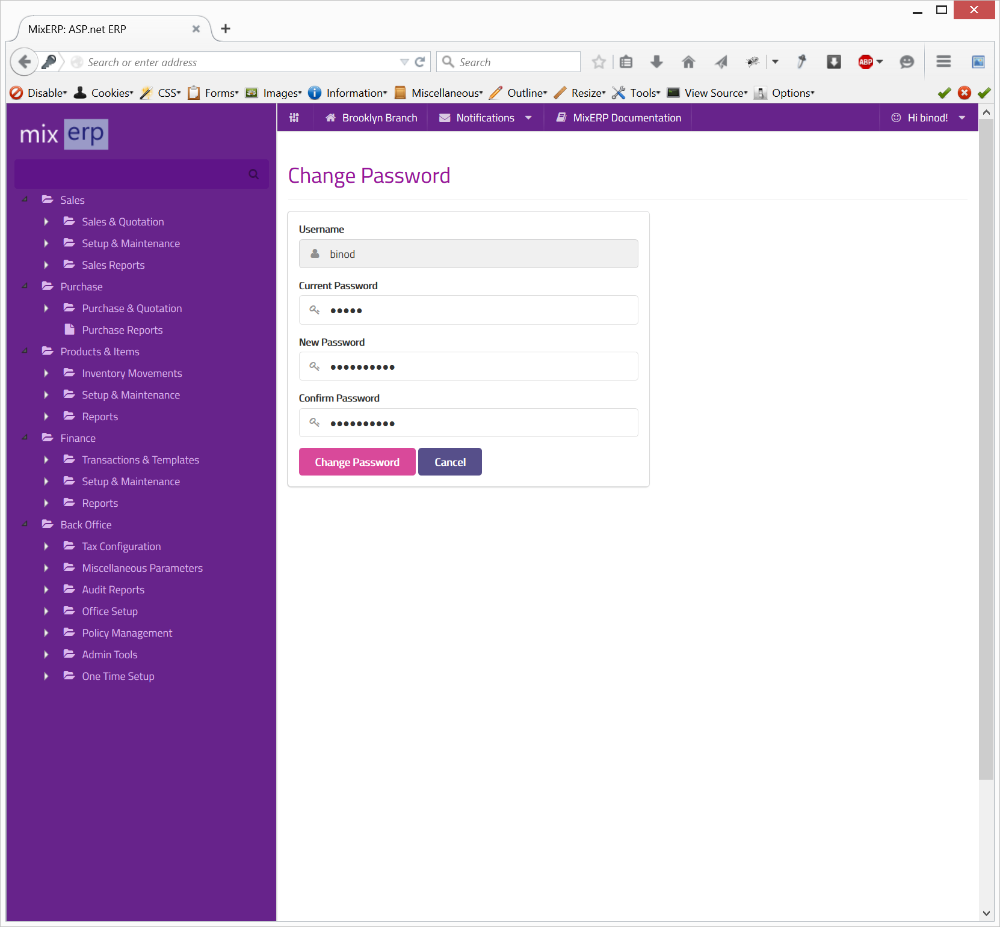

#Change Password

In order to change your password, click your name on the top right of the screen and then click **Change Password**.

* Enter your existing password on the field **Current Password**.
* Enter a new password in the field **New Password**.
* Confirm your new password by typing it again in the field **Confirm Password**.
* Click the button **Change Password**.

    Consult with your administrator if you want help with changing or resetting your password.

##Related Topics
* [MixERP User Guide](../index.md)