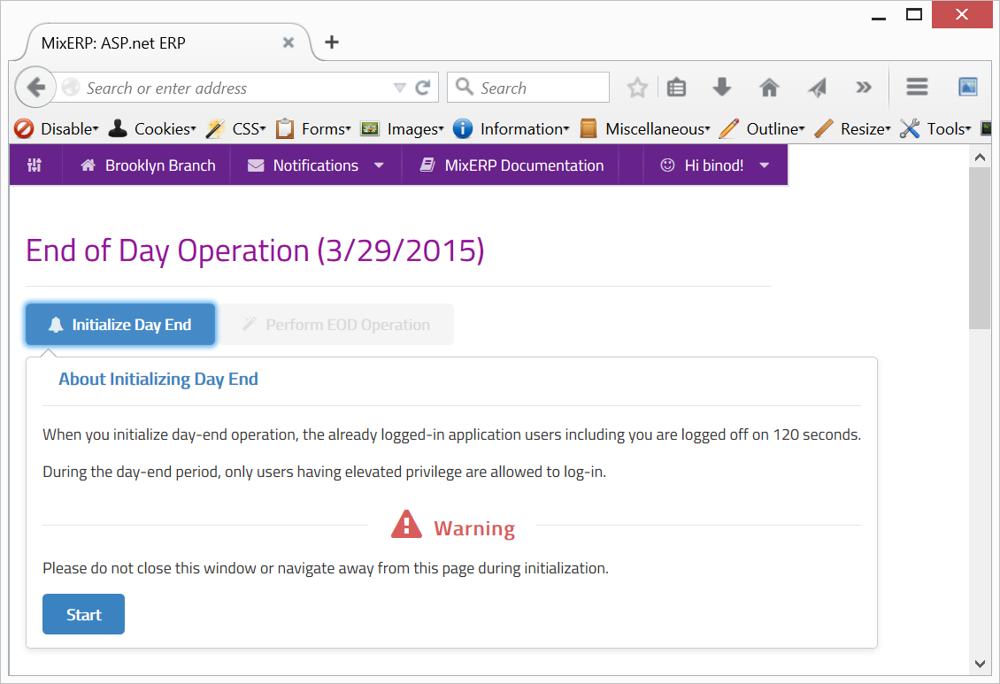

#End of Day Operation

Traditional ERP solutions fail their users by allowing transactions to be posted on past or future date.
Allowing a transaction to be posted on a past date offers various inconsistencies, which are described in the chapter:

[Past Dated Transactions](past-dated-transactions.md)

Since past dating is dangerous and introduces side-effects, MixERP completely disallows this functionality.
It is absolutely safe to assume that you cannot edit, delete, or add transactions on a past date. However, future dating 
is allowed which merely stores transactions on the [verification-queue](verification-queue.md) 
having no real effect on final accounts.

#Concept
EOD operation performs several routine tasks, including but not limited to, the following :

* posting late fee
* posting recurring invoices
* posting bonus
* generating reports

MixERP being a multi-establishment ERP solution treats each branch office as a separate entity. This means that branch offices
can have different [current dates](current-date.md) and work independently.

#How to Perform EOD Operation

The EOD operation generally involves two steps. The first step is to initialize EOD operation and the next one is to 
actually perform EOD operation.

##Initializing EOD Operation

To initialize EOD operation is to inform the currently logged on application users to save their existing work.
When the EOD operation is initialized, a warning is generated and users are automatically signed off after a certain duration.

EOD operation is admin-only task and requires [elevated privilege](elevated-privilege.md). Once you start EOD, you should not:

* navigate away from the page
* close the browser

<video src="videos/initialize-eod.webm" controls>
   Your browser does not implement html5 video. [Click here](videos/initialize-eod.webm) to download.
</video>

Once the EOD initialization is complete, everyone including you will be signed off, as shown in the video above.

##Performing EOD Operation

Sign in again to MixERP. If your user account does not have elevated privilege, you will not be able to sign in. Ask
your administrator to provide you an elevated access.

This phase is **restricted transaction mode**, meaning:

* only administrators with elevated privilege can sign in
* you cannot post a transaction

To perform EOD operation, point your mouse to the button **Perform EOD Operation**, and then click the **OK** button.
During the entire EOD operation, you **must stay on this page**.

Let's have a look on how EOD is performed.

<video src="videos/perform-eod.webm" controls>
   Your browser does not implement html5 video. [Click here](videos/perform-eod.webm) to download.
</video>

##Related Topics

* [Current date](current-date.md)
* [Verification Queue](verification-queue.md)
* [Transaction Posting Engine](transaction-posting-engine.md)