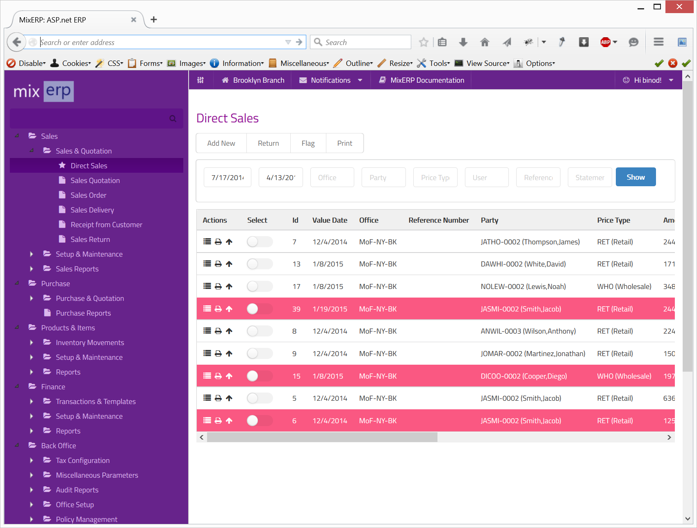

#Flag

Flagging is a way to mark a transaction for future review. When you flag a transaction, the other users will not be able
to see it. Let's see how it works first and let's take an example of direct sales view. 

##Looks Like This at First

To flag, select one or several rows and then click the button **Flag**.

Click **Update** to save the flag.

##Looks Like This after Flagging

##Concept
MixERP does not use flag for anything but display purpose. A flagged view is not shared and is thus unique for each user.
A user may use the flagging feature to mark a transaction with a flag for their own purpose.

Moreover, we believe that flagging feature
would be very useful to a user to quickly remember a transaction. You are, therefore, advised to flag as little transactions as possible
so that you will not have an information overload; as many transactions as possible, so that it makes 
a perfect sense to you and only you.

There is no right, best, or perfect way for flagging transactions. What you do is the best practice.

##Related Topics
* [MixERP User Guide](../index.md)