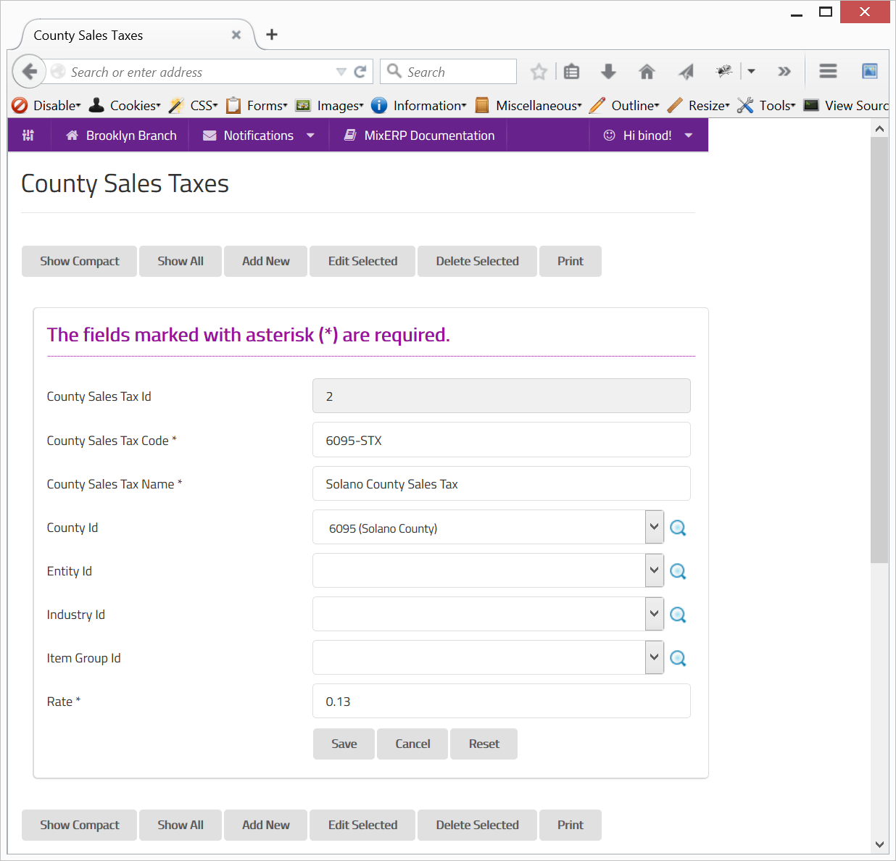

#County Sales Taxes

In United States and some other countries, there are several federal taxes including the county sales tax. A
sales tax can differ from one county to the other. Similarly, a county sales tax can have different rates based
on:

* Type of Customer (Establishment/Corporation/Entity)
* Type of Customer (Industry)
* Type of Item
* Any combination of the above three.

##Fields

**County Sales Tax Id**

This is an auto-generated and read-only field.

**County Sales Tax Code**

Provide a unique code for the county sales tax.

**County Sales Tax Name**

Provide a name for the county sales tax.

**County Id**

Select the county or search by clicking the icon <i class="item-selector"></i>.

**Entity Id**

Select the entity or search by clicking the icon <i class="item-selector"></i>.

**Industry Id**

Select the entity or search by clicking the icon <i class="item-selector"></i>.

**Item Group Id**

Select the entity or search by clicking the icon <i class="item-selector"></i>.

**Rate**

Enter the tax rate in percentage.

    Since this form implements ScrudFactory helper module, the detailed explanation of this feature is not provided
    in this document. View <a href="../../core-concepts/scrud-factory.md">ScrudFactory Helper Module Documentation</a>
    for more information.

##Related Topics

* [Sales Tax](sales-tax.md)
* [Understanding & Configuring Taxes](../understanding-and-configuring-taxes.md)