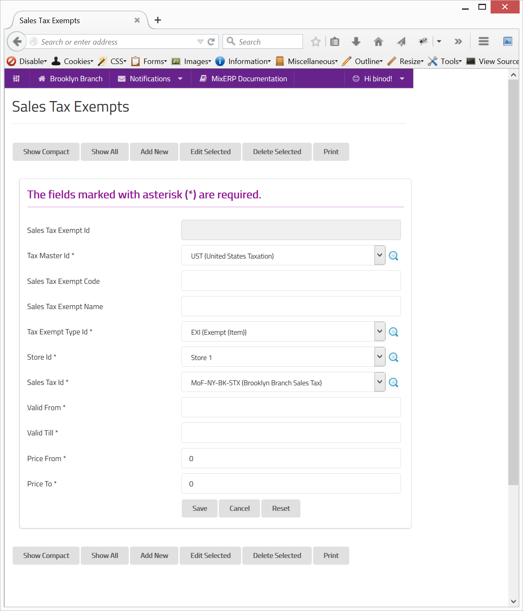

#Sales Tax Exempts & Tax Holidays

A sales transaction maybe subject to tax exempt, including but not limited to the following conditions:

* The item being sold is an exempted item. (Tax Exempt Type Id)
* The customer is subject to tax exemption. (Tax Exempt Type Id)
* The sales transaction is originating from a certain place. (Store Id)
* The date of the sales transaction is happening during a certain period. (Valid From, Valid To)
* The price of the item being sold is between a certain amount range. (Price From, Price To)

##Fields

**Sales Tax Exempt Id**

This is an auto-generated and read-only field.

**Sales Tax Exempt Code**

Provide a unique code for the sales tax exempt.

**Sales Tax Exempt  Name**

Provide a name for the sales tax exempt.

**Tax Exempt Type Id**

Select the tax exempt type or search by clicking the icon <i class="item-selector"></i>.

**Store Id**

Select the store or search by clicking the icon <i class="item-selector"></i>.

**Sales Tax Id**

Select the sales tax or search by clicking the icon <i class="item-selector"></i>.

**Valid From, Valid To**

Provide a duration during which the exemption will be valid and effective.

**Price From, Price To**

Provide a price range for which exemption will be effective. The items falling in this price range
will be exempted.

    Since this form implements ScrudFactory helper module, the detailed explanation of this feature is not provided
    in this document. View <a href="../../core-concepts/scrud-factory.md">ScrudFactory Helper Module Documentation</a>
    for more information.

##Related Topics

* [Sales Tax](sales-tax.md)
* [Understanding & Configuring Taxes](../understanding-and-configuring-taxes.md)