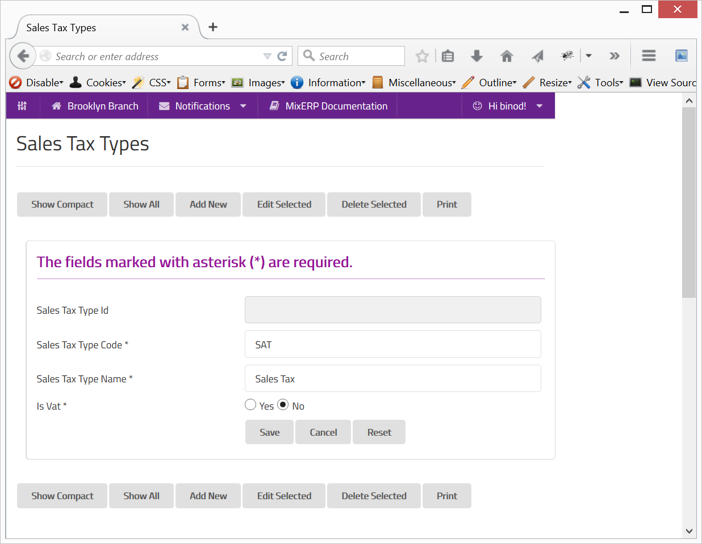

#Sales Tax Types

MixERP supports various type of sales taxes, which can be defined in this window. A sales tax can be either VAT/GST enabled or plain-old
sales tax.

##Value Added Tax

Unlike sales tax, a value added tax is applied to (taxable) items on each transaction.

This means, when you purchase an item, you pay VAT, and when you sell an item, you collect VAT. 
The tax (VAT) you pay while purchasing is your receivable amount, whereas the tax you collect when selling is your payable amount.

Likewise, your business would need to file a VAT report at the end of a transaction period, which may be one of the following:

* EOM (End of Month)
* EOQ (End of Quarter)
* EOH (End of Half)
* EOY (End of Year)

The total tax you need to submit/remit to the tax authority would be the difference of the VAT amount.

Payable VAT = Collected VAT (On Sales) - Paid VAT (On Purchases).

For more information, please refer to the following article in Wikipedia:

[http://en.wikipedia.org/wiki/Value-added_tax](http://en.wikipedia.org/wiki/Value-added_tax)

##Fields

**Sales Tax Type Id**

This is an auto-generated and read-only field.

**Sales Tax Type Code**

Provide a unique code for the sales tax type.

**Sales Tax Type Code**

Provide a name for the sales tax type.

**Is VAT**

Check this on if the sales tax type you are creating is a Value Added Tax.

    Since this form implements ScrudFactory helper module, the detailed explanation of this feature is not provided
    in this document. View <a href="../../core-concepts/scrud-factory.md">ScrudFactory Helper Module Documentation</a>
    for more information.

##Related Topics

* [Sales Tax](sales-tax.md)
* [Understanding & Configuring Taxes](../understanding-and-configuring-taxes.md)