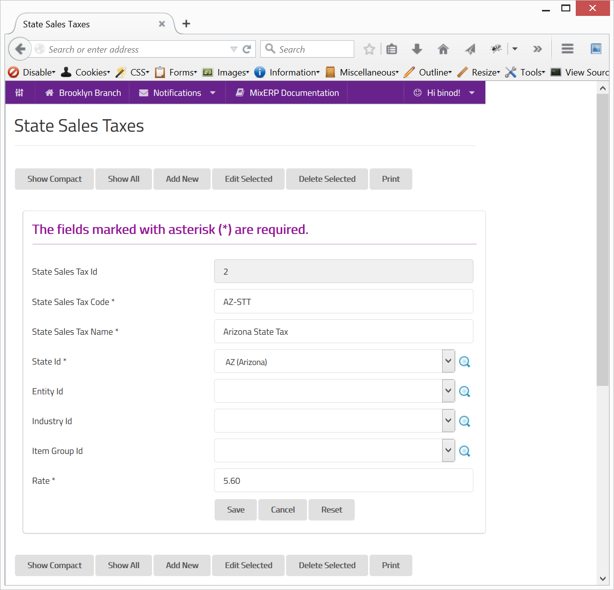

#State Sales Taxes

In United States and some other countries, there are several federal taxes including the state sales tax. 
A state government may have a totally different sales tax rate(s) than the other. Interestingly, the state government may
require you to apply different sales tax for the same item, depending on :

##Type of Customer

* Type of Establishment (Entity)
* Type of Industry

##Type of Item

Some items would be tax exempt in one state. But this would not necessarily be the same in another state. Similarly,
a state government may impose a higher or lower tax rate based on the type of an item.

##Combination of Customer Type and Item Type

In some states, an item may qualify for much lower tax rate when sold to a certain industry or corporation type, while remaining the 
same for all other cases.

##Remember

* It is advised that you understand the tax requirement of your state government, including your
nexus state governments. Please consult with a professional or even the state governments for more information 
about your tax requirement.
* In MixERP, you must configure state sales tax information for all states you operate in, including your nexus presence.

##Fields

**State Sales Tax Id**

This is an auto-generated and read-only field.

**State Sales Tax Code**

Provide a unique code for the state sales tax.

**State Sales Tax Name**

Provide a name for the state sales tax.

**State Id**

Select the state or search by clicking the icon <i class="item-selector"></i>.

**Entity Id**

Select the entity or search by clicking the icon <i class="item-selector"></i>.

**Industry Id**

Select the entity or search by clicking the icon <i class="item-selector"></i>.

**Item Group Id**

Select the entity or search by clicking the icon <i class="item-selector"></i>.

**Rate**

Enter the tax rate in percentage.

    Since this form implements ScrudFactory helper module, the detailed explanation of this feature is not provided
    in this document. View <a href="../../core-concepts/scrud-factory.md">ScrudFactory Helper Module Documentation</a>
    for more information.

##Related Topics

* [Sales Tax](sales-tax.md)
* [Understanding & Configuring Taxes](../understanding-and-configuring-taxes.md)