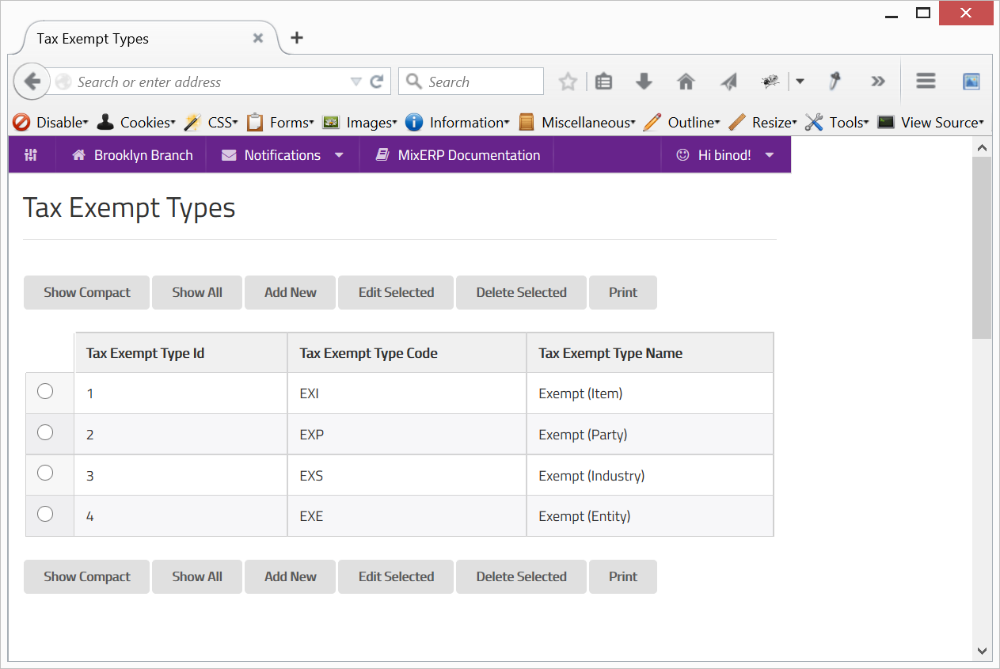
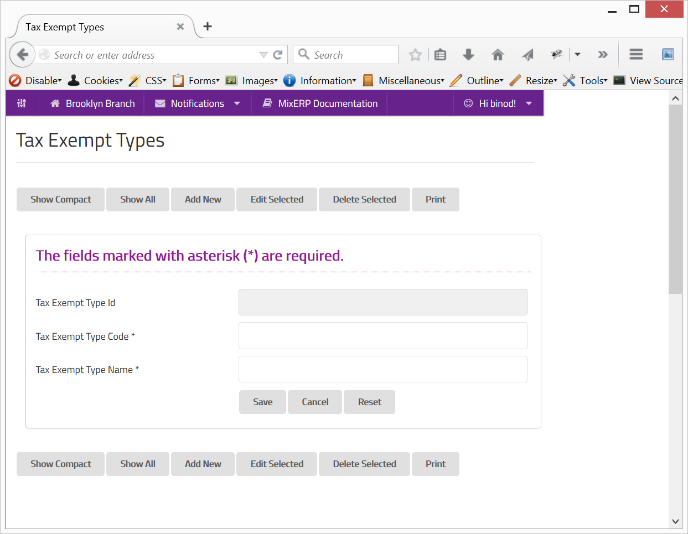

#Tax Exempt Types

A sales transaction can be subject to tax exemption based on:

* Type of Customer
* Type of Item Being Sold

Sometimes, a business may directly be entitled to tax exemptions, thus making them eligible to lower tax rates
or even no tax at all. It is, therefore, convenient to create exemption types in MixERP beforehand.

##Fields

**Tax Exempt Type Id**

This is an auto-generated and read-only field.

**Tax Exempt Type Code**

Provide a unique code for the tax exempt type.

**Tax Exempt Type Name**

Provide a name for the tax exempt type.

    Since this form implements ScrudFactory helper module, the detailed explanation of this feature is not provided
    in this document. View <a href="../../core-concepts/scrud-factory.md">ScrudFactory Helper Module Documentation</a>
    for more information.

##Related Topics

* [Sales Tax](sales-tax.md)
* [Understanding & Configuring Taxes](../understanding-and-configuring-taxes.md)