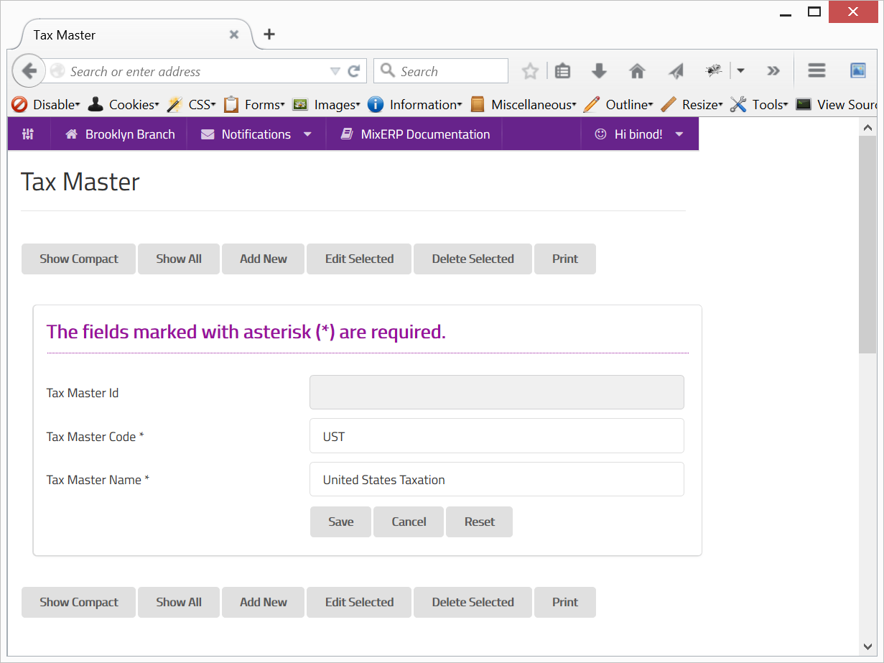

#Tax Master

Tax master is a tax configuration repository where you define various taxes.

Depending on where your business operates, a tax master generally contains list of tax configuration based on the
countries of your business activities.

##Fields

**Tax Master Id**

This is an auto-generated and read-only field.

**Tax Master Code**

Provide a unique code for the tax master.

**Tax Master Name**

Provide a name for the tax master.

    Since this form implements ScrudFactory helper module, the detailed explanation of this feature is not provided
    in this document. View <a href="../../core-concepts/scrud-factory.md">ScrudFactory Helper Module Documentation</a>
    for more information.

##Related Topics

* [Sales Tax](sales-tax.md)
* [Understanding & Configuring Taxes](../understanding-and-configuring-taxes.md)