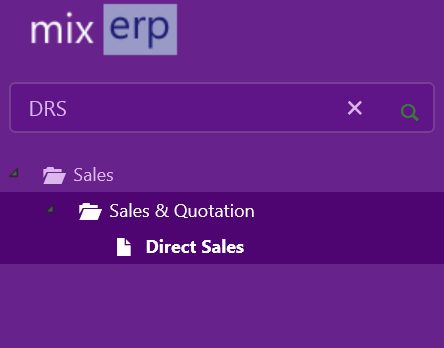

#Understanding MixERP Menu

MixERP features an easy to use menu system where resources are categorized as:

 - Menu node having children (Parent menu item)
 - Menu item
 - Current page menu item

###Menu Node with Children
A menu node with child items is represented by a *folder icon*. This serves as a parent node in the tree.

###Menu Item
A menu item is represented by a *file icon*.  A menu item when clicked will generally navigate to its URL address. Each menu item has an associated code which is referred to as **MenuCode**. The primary function of a **MenuCode** is to be used as a shortcut to access it using a keyboard instead of mice.

###Current Page Menu Item
The current page menu is represented by a star icon. It is selected by default.

###Keyboard Shortcuts
| Key Combination | Scope         | Description           |
|-----------------|-------------|----------------------|
| Ctrl + M                | Anywhere on the document | Bring the focus (caret) to menu filter input control              |
| Ctrl +  ,                 | Anywhere on the document | Place the focus to the current page menu item         |
| Enter                    | Menu filter input control      | Navigate to the Url address of the first menu item result     |
| Enter                    | Tree menu collection            | Navigate to the Url address of the selected menu item       |
| Up Arrow              | Tree menu collection            | Go to the previous menu item                                              |
| Left Arrow            | Tree menu collection            | Go to the previous menu item or collapse children if parent node |
| Down Arrow         | Tree menu collection            | Go to the next menu item                                                    |
| Right Arrow            | Tree menu collection           | Go to the next menu item or expand  children if parent node |

##Related Topics
* [MixERP User Guide](../index.md)