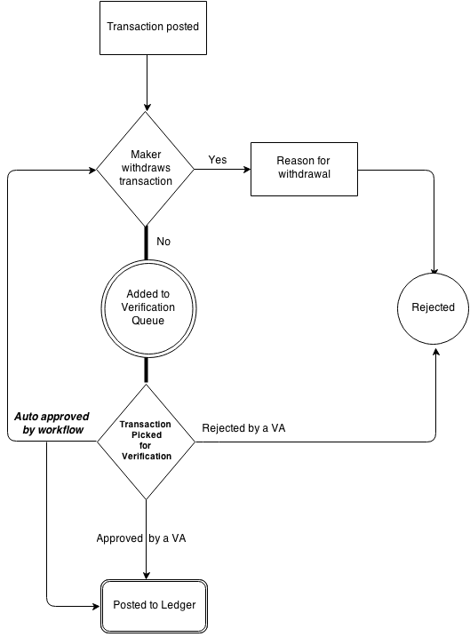

##Voucher Verification

The verification module is a feature of MixERP's Transaction Posting Engine. The workflow provides **MC (maker/checker)** verification system where the transactions entered by users are presented to a group of 
delegated users collectively known as **Voucher Administrators**. Once a transaction is posted, it is sent to the **verification queue**. 
The VAs can then take further actions on what to do with the transactions in the queue.

Moreover, on a default installation, **makers** are generally restricted users able to only post a transaction, and cannot take decisions on
their own. However, makers can **withdraw** their own transaction(s) stating a reason why they want it to be withdrawn.
When a transaction is withdrawn, it is not sent to the [Verification Queue](verification-queue.md), and thus has no effect on the balance sheet.

Furthermore, as seen in the above diagram, a transaction can be automatically verified by the workflow engine. According to your configuration,
the TransactionGovernor module will automatically take actions to reject or approve vouchers in verification queue. This could be beneficial for
offices having a relatively tight budget, since you would not need to appoint additional employee(s) to check the queue.

The automatic verification feature can be a real time-saver for certain scenarios where you could "mix" the automatic and manual
verification system. For example, you could turn on the auto-verification for transactions less than a specified amount, and for larger 
transactions you can *examine what's going on under the hood* in the real time.

##Transaction Checklists

Once you post a sales transaction, the module **TransactionChecklist** further helps application users to take necessary 
actions such as:

* [Withdraw the Posted Transaction](withdraw-transaction.md).
* View the Document.
* Send the Document as an Email Attachment to the Customer.
* Create & Print Customer Copy of the Document.
* Print Receipt.*
* Print GL Entry.*
* [Upload Attachments for the Document](attachment-manager.md).

*  where applicable

##Related Topics
* [Sales Module](../sales/index.md)
* [MixERP User Guide](../index.md)

