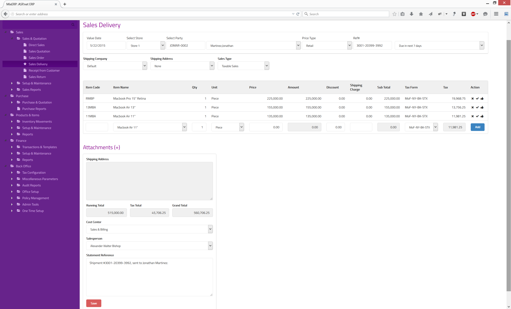
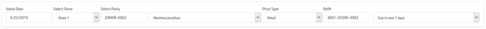
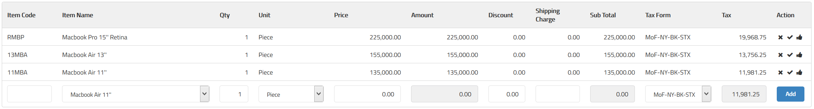
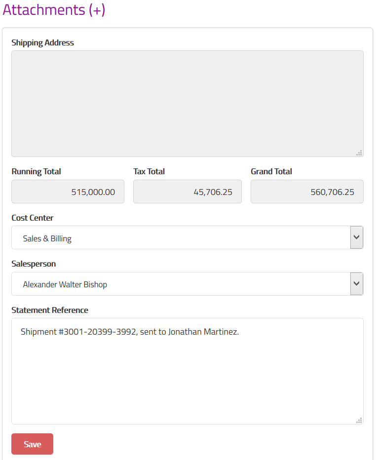
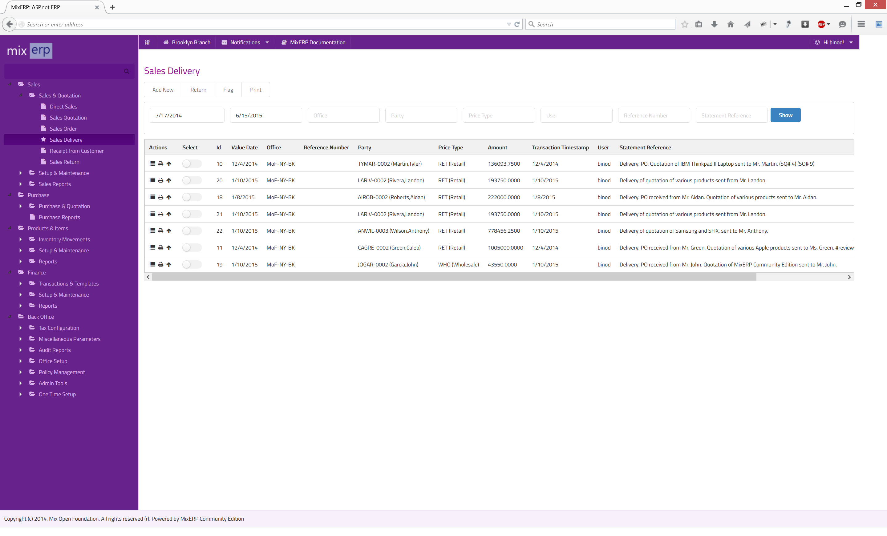

#Sales Delivery

Once you accept a purchase order sent by your customer(s), you will then need to perform 
additional steps to deliver the goods which is known as sales delivery. A sales delivery document
is created when the shipment is sent to the customer from you store.

#For Accountants

A sales delivery entry creates the following GL entries:

##If Perpetual Inventory System

<table border="1" style="border-collapse:collapse;border:1px solid black;width:100%;">
    <thead>
        <tr>
            <td>
                Account
            </td>
            <td>
                Type
            </td>
            <td>
                Mapping
            </td>
            <td>
                Amount
            </td>
        </tr>
    </thead>
    <tbody>
        <tr>
            <td>
                Sales Account
            </td>
            <td>
                Incomes
            </td>
            <td>
                Item Groups
            </td>
            <td>
                Credit
            </td>
        </tr>
        <tr>
            <td>
                Inventory Account
            </td>
            <td>
                Assets
            </td>
            <td>
                Item Groups
            </td>
            <td>
                Credit
            </td>
        </tr>
        <tr>
            <td>
                Tax Account (If Applicable)
            </td>
            <td>
                Accounts Payable
            </td>
            <td>
                Tax Form
            </td>
            <td>
                Credit
            </td>
        </tr>
        <tr>
            <td>
                Shipper Account (If Applicable)
            </td>
            <td>
                Accounts Payable
            </td>
            <td>
                Shipper
            </td>
            <td>
                Credit
            </td>
        </tr>
        <tr>
            <td>
                Associated Party's GL Account
            </td>
            <td>
                AP/AR
            </td>
            <td>
                Party Account
            </td>
            <td>
                Debit
            </td>
        </tr>
        <tr>
            <td>
                COGS Account
            </td>
            <td>
                Expenses
            </td>
            <td>
                Item Groups
            </td>
            <td>
                Debit
            </td>
        </tr>
        <tr>
            <td>
                Sales Discount (If Applicable)
            </td>
            <td>
                Expenses
            </td>
            <td>
                Item Groups
            </td>
            <td>
                Debit
            </td>
        </tr>
    </tbody>
</table>

##If Periodic Inventory System

<table border="1" style="border-collapse:collapse;border:1px solid black;width:100%;">
    <thead>
        <tr>
            <td>
                Account
            </td>
            <td>
                Type
            </td>
            <td>
                Mapping
            </td>
            <td>
                Amount
            </td>
        </tr>
    </thead>
    <tbody>
        <tr>
            <td>
                Sales Account
            </td>
            <td>
                Incomes
            </td>
            <td>
                Item Groups
            </td>
            <td>
                Credit
            </td>
        </tr>
        <tr>
            <td>
                Tax Account (If Applicable)
            </td>
            <td>
                Accounts Payable
            </td>
            <td>
                Tax Form
            </td>
            <td>
                Credit
            </td>
        </tr>
        <tr>
            <td>
                Shipper Account (If Applicable)
            </td>
            <td>
                Accounts Payable
            </td>
            <td>
                Shipper
            </td>
            <td>
                Credit
            </td>
        </tr>
        <tr>
            <td>
                Associated Party's GL Account
            </td>
            <td>
                AP/AR
            </td>
            <td>
                Party Account
            </td>
            <td>
                Debit
            </td>
        </tr>
        <tr>
            <td>
                Sales Discount (If Applicable)
            </td>
            <td>
                Expenses
            </td>
            <td>
                Item Groups
            </td>
            <td>
                Debit
            </td>
        </tr>
    </tbody>
</table>

#Posting a Sales Delivery

##Top Section

**Value Date**

The effective date of sales delivery posting.

**Select Store**

Select a store from where you want to deliver goods.

**Select Party**

Select the customer who sent the PO.

    This is a cascading field. When you enter a valid party code in the text box, the associated party
    will be automatically chosen in the drop down control.

**Price Type**

Select the price type associated with this transaction. On a default installation of MixERP, price types are :

* Retail
* Wholesale

Depending on the price type, effective items selling prices will be displayed.

**Ref #**

Enter a reference number for this transaction, which will be helpful for filtering transactions later.
If applicable, use this field to enter the shipment number associated with the delivery.

**Payment Term**

Select a payment term you would like to link this document to. If the payment term you selected
has an associated late fee, MixERP will start posting fines (late fee) once the term is over
and the receivable amount was not collected.

**Shipping Company**

Select the shipping company for delivering goods.

**Shipping Address**

A party may have multiple shipping addresses. So, select the desired shipping address code here.
Once you select a shipping address code, the destination will be shown on the field 
**Shipping Address** on the bottom section of this document.

**Sales Type**

Select a sales type from the list.

##Details Section

**Item Code**

Enter a valid item code of the product, which will automatically cascade to the field **Item Name**.

**Item Name**

Select the item from the drop down control. This field will automatically update the field **Item Code**.

**Qty**

Enter the quantity of items you are quoting.

**Unit**

Select the unit associated with the item selected earlier.

**Price**

Once you select an item and provide unit and quantity, the unit price will automatically be updated.
However, you can override the price shown for this quote.

**Amount**

This is a computed field.

Amount = Qty * Price

**Discount**

Enter a flat amount here if you wish to provide a discount.

**Shipping Charge**

Enter shipping charge for this item.

**Sub Total**

This a computed field.

Sub Total = Amount - Discount + Shipping Charge

**Tax Form**

Select a sales tax from the list. Once you leave this field, tax is calculated and updated on the field
**Tax**.

**Tax**

This is a computed field.

**Add**

Click this button or **hit CTRL + RETURN** to add the current line to the grid.

##Bottom Section

**Attachments**

See [Inline Attachment Manager](../../user-guide/core-concepts/inline-attachment-manager.md)

**Shipping Address**

This is a readonly field, updated by the field **Shipping Address** in the top section.

**Running Total**

This is a computed field.

Running Total = Sum of Sub Totals

**Tax Total**

This, also, is a computed field.

Tax Total = Sum of Taxes

**Grand Total**

This, also, is a computed field.

Grand Total = Running Total + Tax Total

**Cost Center**
Select a cost center from the drop down control.

**Salesperson**

Select the salesperson from the drop down control.

**Statement Reference**

Enter a text reference or a memo which helps explain this transaction when you read it later.

**Save**

Click this button to save the quotation.

#Understanding Sales Delivery View

As soon as you post a sales delivery transaction, it is sent to the [verification queue](../core-concepts/verification-queue.md).
If the posting user has an active autoverification policy having the 
**[sales verification limit amount](../back-office/policy/auto-verification.md)** 
greater than or equal to the total amount of this transaction, it will be automatically approved.

Also see, [voucher verification feature](../core-concepts/voucher-verification.md) for more information.

Now, once the sales delivery transaction is approved, it appears in this view. You can then take further actions
like posting a sales return entry or flagging transactions, if required; both, individually or in batches.

##Return

Click this button to post a sales return entry against the selected sales delivery.

##Flag

See the chapter [Flag](../../user-guide/core-concepts/flags.md) for more information on flagging transactions.

##Related Topics
* [Sales Module](index.md)
