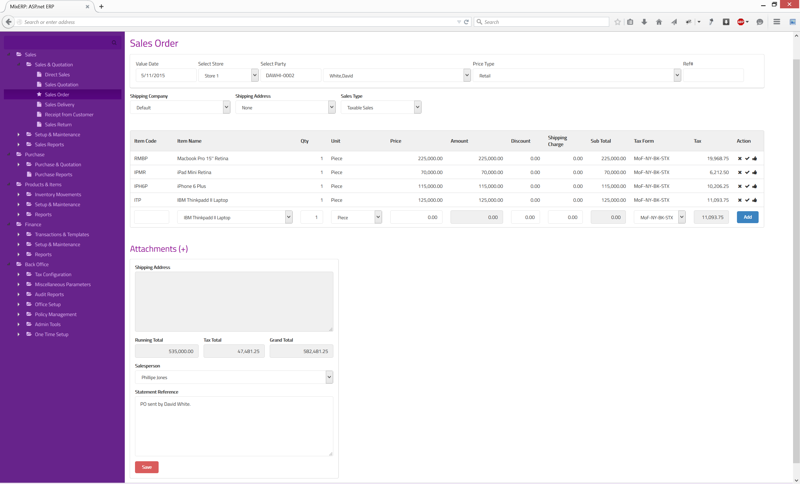
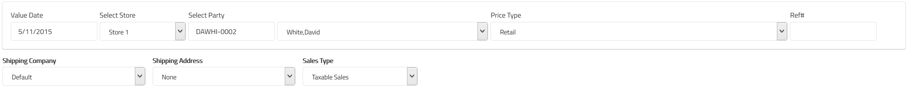
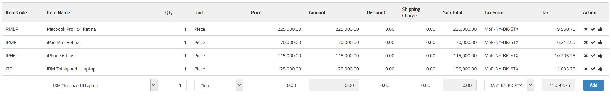
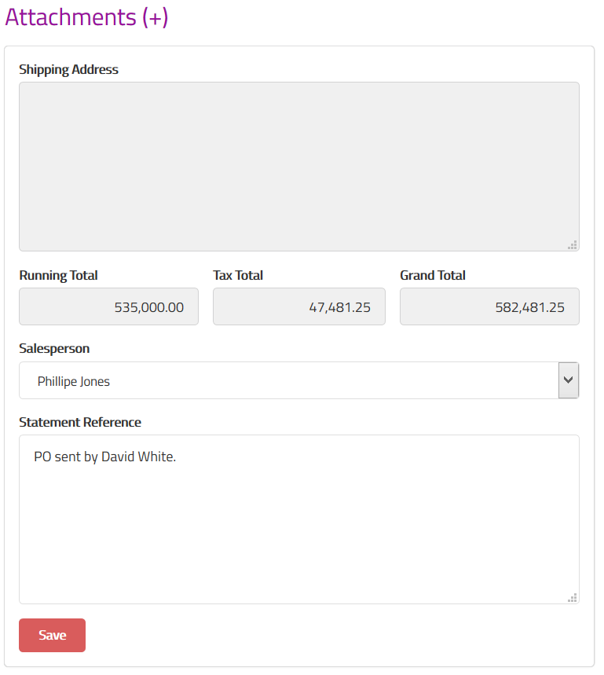
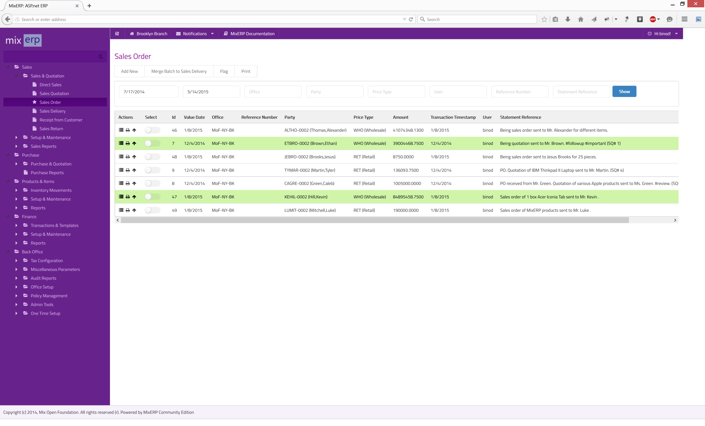

#Sales Order

When you receive a purchase order from your customer, you enter it as sales order document in MixERP.

Purchase order, prepared and sent by your customer, contains a list of items, number of units, and agreed-upon
price.

Once you accept a purchase order sent by your customer(s), you will then need to perform 
additional steps to deliver the goods and collect the sales money, which are known as sales delivery
and receipt respectively.

#For Accountants

A sales order entry does not create any associated GL entry in the transaction tables.

#Posting a Sales Order

##Top Section

**Value Date**

The effective date of sales order posting.

**Select Store**

Select a store from where you want to deliver goods during sales delivery.

**Select Party**

Select the customer who sent the PO.

    This is a cascading field. When you enter a valid party code in the text box, the associated party
    will be automatically chosen in the drop down control.

**Price Type**

Select the price type associated with this transaction. On a default installation of MixERP, price types are :

* Retail
* Wholesale

Depending on the price type, effective items selling prices will be displayed.

**Ref #**

Enter a reference number for this transaction, which will be helpful for filtering transactions later.
If applicable, use this field to enter the PO number associated with the PO document which came in.

**Shipping Company**

Select the shipping company for delivering goods during sales delivery.

**Shipping Address**

A party may have multiple shipping addresses. So, select the desired shipping address code here.
Once you select a shipping address code, the destination will be shown on the field 
**Shipping Address** on the bottom section of this document.

**Sales Type**

Select a sales type from the list.

##Details Section

**Item Code**

Enter a valid item code of the product, which will automatically cascade to the field **Item Name**.

**Item Name**

Select the item from the drop down control. This field will automatically update the field **Item Code**.

**Qty**

Enter the quantity of items you are quoting.

**Unit**

Select the unit associated with the item selected earlier.

**Price**

Once you select an item and provide unit and quantity, the unit price will automatically be updated.
However, you can override the price shown for this quote.

**Amount**

This is a computed field.

Amount = Qty * Price

**Discount**

Enter a flat amount here if you wish to provide a discount.

**Shipping Charge**

Enter shipping charge, if applicable.

**Sub Total**

This a computed field.

Sub Total = Amount - Discount + Shipping Charge

**Tax Form**

Select a sales tax from the list. Once you leave this field, tax is calculated and updated on the field
**Tax**.

**Tax**

This is a computed field.

**Add**

Click this button or **hit CTRL + RETURN** to add the current line to the grid.

##Bottom Section

**Attachments**

See [Inline Attachment Manager](../../user-guide/core-concepts/inline-attachment-manager.md)

**Shipping Address**

This is a readonly field, updated by the field **Shipping Address** in the top section.

**Running Total**

This is a computed field.

Running Total = Sum of Sub Totals

**Tax Total**

This, also, is a computed field.

Tax Total = Sum of Taxes

**Grand Total**

This, also, is a computed field.

Grand Total = Running Total + Tax Total

**Salesperson**

Select the salesperson from the drop down control.

**Statement Reference**

Enter a text reference or a memo which helps explain this transaction when you read it later.

**Save**

Click this button to save the quotation.

#Understanding Sales Order View

As soon as you post a sales order transaction, it appears in this view. You can then take further actions
like automating, merging, and/or flagging transactions, both individually or in batches.

##Merge Batch to Sales Delivery

Click this button to create a sales delivery entry against the selected sales order(s).

##Flag

See the chapter [Flag](../../user-guide/core-concepts/flags.md) for more information on flagging transactions.

##Related Topics
* [Sales Module](index.md)
