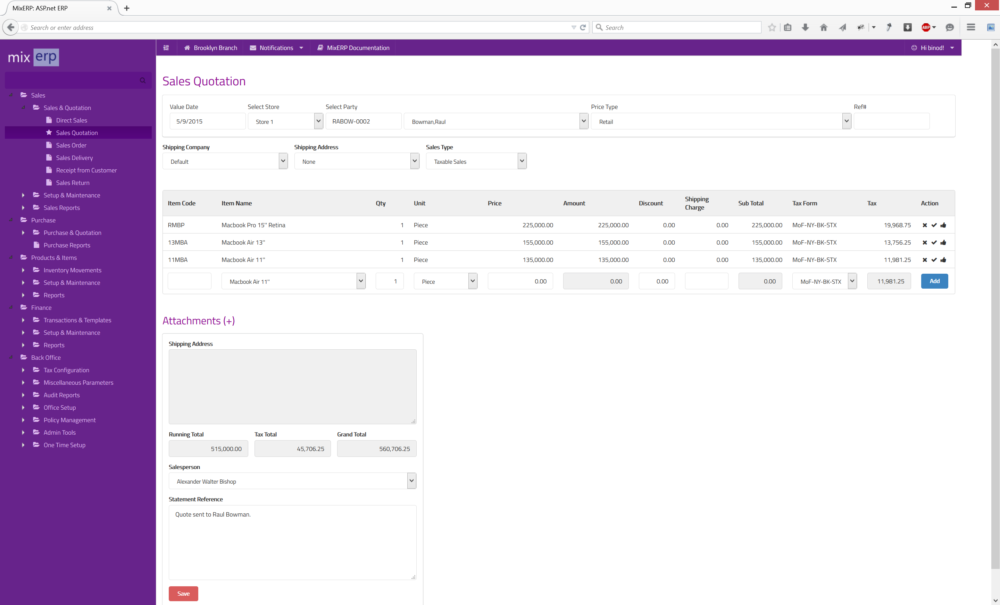
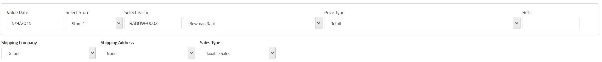
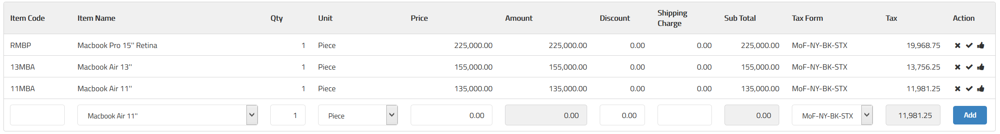
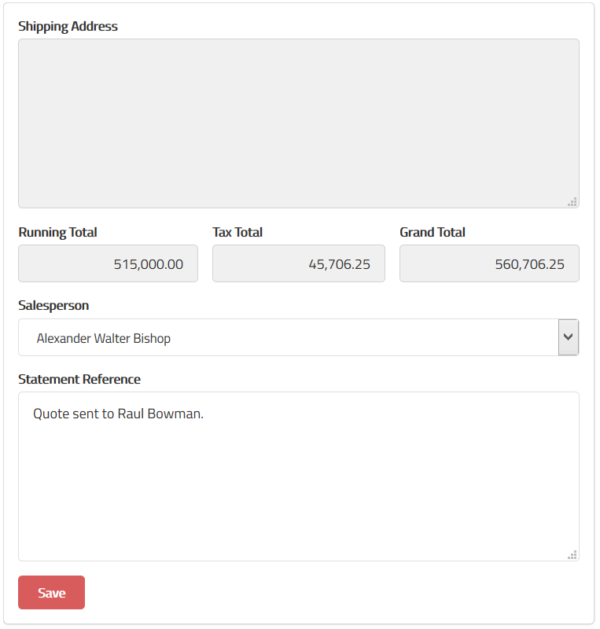
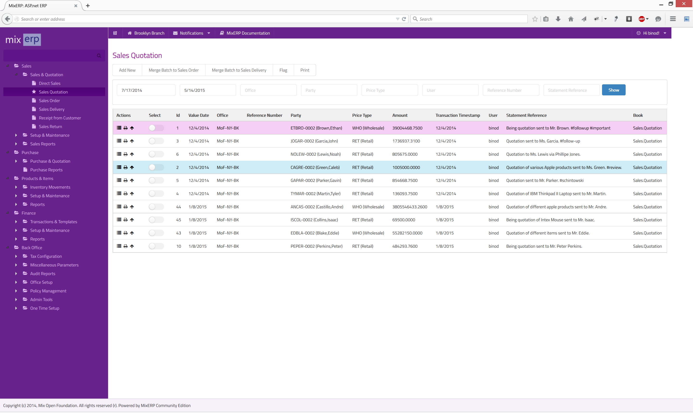

#Sales Quotation

A business has prospective customers, who are interested to first know the cost of
item(s) (products or services) before they actually make a purchase.
Creating a quotation is the first step in the sales cycle which enables you to provide an
estimated price of goods or service a customer is interested in.

#For Accountants

A sales quotation entry does not create any associated GL entry in the transaction tables.

#Creating a Sales Quotation

##Top Section

**Value Date**

The effective date of quotation posting.

**Select Store**

Select a store from where you want to deliver goods if this quotation accepted by the client.

**Select Party**

Select a customer for whom you are creating the quote.

    This is a cascading field. When you enter a valid party code in the text box, the associated party
    will be automatically chosen in the drop down control.

**Ref #**

Enter a reference number for this transaction, which will be helpful for filtering transactions later.

**Shipping Company**

Select a shipping company for delivering goods if this quotation is accepted by the client.

**Shipping Address**

A party may have multiple shipping addresses. So, select the desired shipping address code here.
Once you select a shipping address code, the destination will be shown on the field 
**Shipping Address** on the bottom section of this document.

**Sales Type**

Select a sales type from the list:

* Taxable Sales
* Nontaxable Sales

Sales transactions usually incur sales taxes, except when:

* the party you are selling to is tax exempted.
* the goods you are selling is tax exempted.
* there is a tax holiday during this transaction period.
* etc.

For more information, Refer to the chapter [Understanding & Configuring Taxes](../../user-guide/core-concepts/understanding-and-configuring-taxes.md).

##Details Section

**Item Code**

Enter a valid item code of the product, which will automatically cascade to the field **Item Name**.

**Item Name**

Select the item from the drop down control. This field will automatically update the field **Item Code**.

**Qty**

Enter the quantity of items you are quoting.

**Unit**

Select the unit associated with the item selected earlier.

**Price**

Once you select an item and provide unit and quantity, the unit price will automatically be updated.
However, you can override the price shown for this quote.

**Amount**

This is a computed field.

Amount = Qty * Price

**Discount**

Enter a flat amount here if you wish to provide a discount.

**Shipping Charge**

Enter shipping charge, if applicable.

**Sub Total**

This a computed field.

Sub Total = Amount - Discount + Shipping Charge

**Tax Form**

Select a sales tax from the list. Once you leave this field, tax is calculated and updated on the field
**Tax**.

**Tax**

This is a computed field.

**Add**

Click this button or **hit CTRL + RETURN** to add the current line to the grid.

##Bottom Section

**Attachments**

See [Inline Attachment Manager](../../user-guide/core-concepts/inline-attachment-manager.md)

**Shipping Address**

This is a readonly field, updated by the field **Shipping Address** in the top section.

**Running Total**

This is a computed field.

Running Total = Sum of Sub Totals

**Tax Total**

This, also, is a computed field.

Tax Total = Sum of Taxes

**Grand Total**

This, also, is a computed field.

Grand Total = Running Total + Tax Total

**Salesperson**

Select the salesperson from the drop down control.

**Statement Reference**

Enter a text reference or a memo which helps explain this transaction when you read it later.

**Save**

Click this button to save the quotation.

#Quickstart Guide

<video src="videos/sales-quotation-entry.webm" style="height:500px;width:900px;" controls>
   Your browser does not implement html5 video. [Click here](videos/initialize-eod.webm) to download.
</video>

#Understanding Sales Quotation View

As soon as you post a sales quotation, it appears in this view. You can then take further actions
like automating, merging, and/or flagging transactions, both individually or in batches.

##Merge Batch to Sales Order

Once the client accepts and approves your quotation, she would further send you a purchase order against the quote
or multiple quotes. Select a row or create a batch by simply checking multiple rows and then click the button
**"Merge Batch to Sales Order"**, which will automatically create a sales order screen for you.

But, before proceeding, just remember that :

* you cannot create a batch by selecting quotation of two different parties.
* a batch cannot contain a previously-merged row.

##Merge Batch to Sales Delivery

You can **entirely skip a step of entering a Sales Order** and jump directly into recording a sales delivery.
Similarly, the merge feature automatically creates a sales delivery screen, as mentioned above.

##Flag

See the chapter [Flag](../../user-guide/core-concepts/flags.md) for more information on flagging transactions.

#Quickstart Guide

<video src="videos/sales-quotation-view.webm" style="height:500px;width:900px;" controls>
   Your browser does not implement html5 video. [Click here](videos/initialize-eod.webm) to download.
</video>

##Related Topics
* [Sales Module](index.md)
