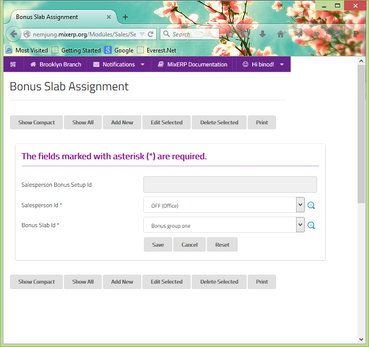

#Bonus Slab Assignment
Here, you simply map the salesperson created under  [salespersons](salespersons.md)
to the bonus schemes created under [bonus slab](bonus-slabs.md). 

##Fields

**Salesperson Bonus Setup Id**

 This is an auto-generated and read-only field.

**Salesperson Id**

Select the salesperson or search by clicking the icon <i class="item-selector"></i>.

**Bonus Slab Id**

 Select the bonus slab or search by clicking the icon <i class="item-selector"></i>.

    Since this form implements ScrudFactory helper module, the detailed explanation of this feature is not provided
    in this document. View <a href="../../core-concepts/scrud-factory.md">ScrudFactory Helper Module Documentation</a>
    for more information.

##Related Topics
* [Setup and Maintenance](../setup-and-maintenance.md)
