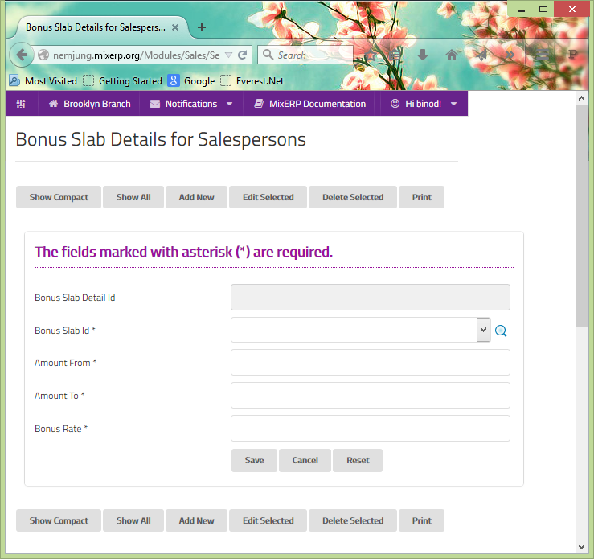

#Bonus Slab Details
After setting up [bonus slabs](bonus-slabs.md) we
can now define the commission rate for different level
of sales volume made by the sales person under the chosen bonus slab. 
Here, you can create various schemes for bonus or commission payments
 to the salesmen. Later the salesmen can be assigned into these bonus 
slabs from Bonus Slab Assignment to pay them bonuses according to the 
slab.

The menu will by default show you the list of bonus slabs that have 
been created so far. The checking frequency decides the frequency of
 posting the payable bonus/commission to the sales man's account. 
For instance, Checking Frequency Id of 'End of Month' will post the
 payable amount of commission for any given sales man to his or her 
account at the end of every month. Enter a slab wise incremental or 
flat bonus rate (in percentage) which increases as the amount 
increases.

##Fields

**Bonus Slab Details Id**

This is an auto-generated and read-only field.

**Bonus Slab Id**

Select the bonus slab or search by clicking the icon <i class="item-selector"></i>.

**Amount From**

Provide the starting amount for the bonus slab details.

**Amount To**

Provide the ending amount for the bonus slab details.

**Bonus Rate** 

Input the rate for the bonus.

    Since this form implements ScrudFactory helper module, the detailed explanation of this feature is not provided
    in this document. View <a href="../../core-concepts/scrud-factory.html">ScrudFactory Helper Module Documentation</a>
    for more information.

##Related Topics
* [Setup and Maintenance](../setup-and-maintenance.md)
