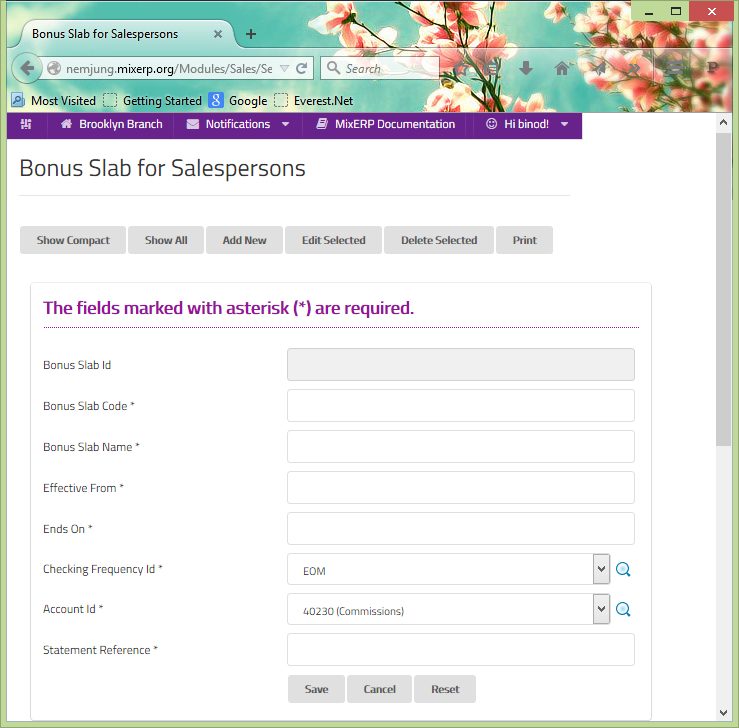

#Bonus Slab for Salespersons
Management must confirm that the salespeople are well encouraged.
Salespersons can be allowed bonus,depending upon the amount (slab) 
of business from their sales. For the success of any business, 
motivation of employee is the key factor. Many successful 
organizations employ a mix of sales incentives. The most common ways 
to manage motivation is to use incentives. 

##Fields

**Bonus Slab Id**

 This is an auto-generated and read-only field.

**Bonus Slab Code**

 Provide a unique code for the bonus slab.

**Bonus Slab Name**

 Provide the name for the bonus slab.

**Effective From**

Choose the starting date of the bonus slab.

**Ends On** 

Choose the ending date of the bonus slab.

**Checking Frequency Id**

Select a bonus posting frequency from the checking frequencies:

* EOM (End of Month)
* EOQ (End of Quarter)
* EOH (End of Half Year) 
* EOY (End of Year). 

**Account Id**

Select the account to be mapped for bonus slab for salesperson.

**Statement Reference**

Brief narration for the transaction.

    Since this form implements ScrudFactory helper module, the detailed explanation of this feature is not provided
    in this document. View <a href="../../core-concepts/scrud-factory.html">ScrudFactory Helper Module Documentation</a>
    for more information.

##Related Topics
* [Setup and Maintenance](../setup-and-maintenance.md)
