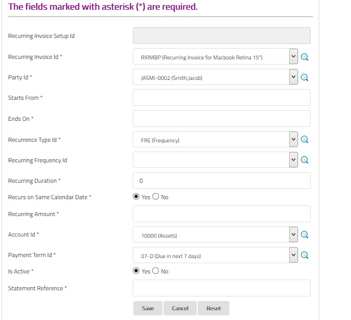

#Recurring Invoice Setup
Recurring Invoice Setup is used to define setup parameters for the
recurring invoices. It is used to setup party, start date, end date,
amount and payment term of the recurring invoices.

##Fields

**Recurring Invoice Setup Id**

 This is an auto-generated and read-only field.

**Recurring Invoice Id**

Select the recurring invoice or search by clicking the icon <i class="item-selector"></i>.

**Party Id**

 Select the party or search by clicking the icon <i class="item-selector"></i>.

**Start From**

 Enter the starting date for the recurring invoice.

**Ends On**

Enter the ending date for the recurring invoice.

**Recurrence Type Id**

Select the recurrence type or search by clicking the icon <i class="item-selector"></i>.

**Recurring Frequency Id**

Select the recurring frequency or or search by clicking the icon <i class="item-selector"></i>.

**Recurring Duration**

Enter the recurring duration in days.

**Recurs on Same Calendar Date**

Click 'Yes' to choose recurrence date as mentioned above.

**Recurring Amount**

Specify the recurring amount of the items.

**Account Id**

Select the account to be mapped for recurring invoices.

**Payment Term Id** 

Select the payment term or search by clicking the icon <i class="item-selector"></i>.

**Statement Reference**

Brief narration for the transaction

    Since this form implements ScrudFactory helper module, the detailed explanation of this feature is not provided
    in this document. View <a href="../../core-concepts/scrud-factory.html">ScrudFactory Helper Module Documentation</a>
    for more information.

##Related Topics
* [Setup and Maintenance](../setup-and-maintenance.md)
