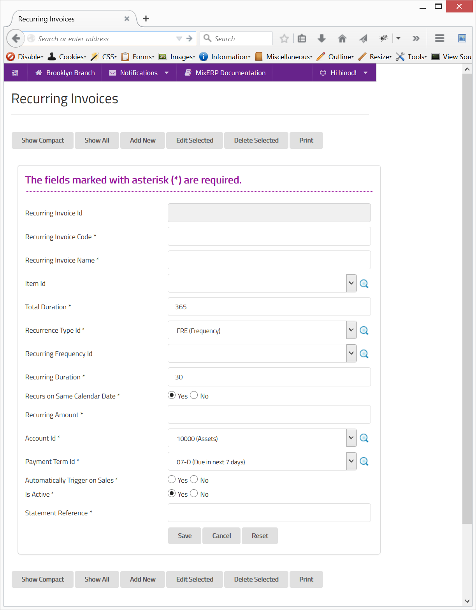

#Recurring Invoices

When your business needs to generate invoices on a regular basis, **Recurring Invoices** feature comes handy.
Not only recurring invoices saves hours of manual posting task, but also it reduces human mistakes.

        Recurring invoices is a workflow which automatically posts invoices on a periodic basis until the
        term (total duration) is over.

So, before you are too overwhelmed by the recurring invoices workflow, let's first understand the GL
entry it produces:

##For Accountants

Whenever a recurring invoice is posted, the following GL entry will be created:

<table border="1" style="border-collapse:collapse;border:1px solid black;width:100%;">
    <thead>
        <tr>
            <td>
                Account
            </td>
            <td>
                Type
            </td>
            <td>
                Amount
            </td>
        </tr>
    </thead>
    <tbody>
        <tr>
            <td>
                Associated Party's GL Account
            </td>
            <td>
                AP/AR
            </td>
            <td>
                Debit
            </td>
        </tr>
        <tr>
            <td>
                Mapped Account *
            </td>
            <td>
                Income Heading
            </td>
            <td>
                Credit
            </td>
        </tr>
        <tr>
            <td colspan="3">
                * Mapped account refers to the <b>"Account Id"</b> field associated with the recurring invoice.
            </td>
        </tr>
    </tbody>
</table>

###FAQs

**Why my recurring invoices are not being posted?**

When creating a recurring invoice, if you switched **"Automatically Trigger on Sales"** off,
you will have to [manually link the recurring invoice](recurring-invoice-setup.md) you created 
to a party account first. 

**When will recurring invoice(s) be posted?**

Recurring invoices are posted during EOD operation.

**Is there any expression support for the statement reference field?**

Yes.

The statement reference field supports a couple of expressions:

**RIMonth**

Parses to the month name of the recurring invoice posting date.

**RIYear**

Parses to the year of the recurring invoice posting date.

**For Example**

The statement reference

*Invoice for the month {RIMonth}-{RIYear}.*

will be parsed as

*Invoice for the month **SEP-2015**.*

if it was posted during September 2015.

**How can I stop a recurring invoice?**

You can switch the field **"Is Active"** off or delete the associated entry in 
[recurring invoice setup](recurring-invoice-setup.md); thenceforth, no further invoices will be generated.

##Core Concepts

A recurring invoice is a template that is attached to a product, item, or service that you sell.
MixERP provides you an option to automatically trigger and create a mapping during sales. In simple terms,
if a recurring invoice is switched on to **"Automatically Trigger on Sales"**, an associated
[recurring-invoice-setup](recurring-invoice-setup.md) entry will be automatically created.

###Scheduling

A recurring invoice is only effective for a period (in days), which can be set in the field **Total Duration**.
There are two kinds of recurrences types :

<table border="1" style="border-collapse:collapse;border:1px solid black;width:100%;">
    <thead>
        <tr>
            <td>
                Recurrence Type
            </td>
            <td>
                Description
            </td>
        </tr>
    </thead>
    <tbody>
        <tr>
            <td>
                Frequency
            </td>
            <td>
                

                    The invoices will be created on the exact frequency definition dates.
                    Therefore, you need to select a <b>Recurring Frequency Id</b> if this option is selected.
                

                

                    When you select this recurrence type, the field <b>Recurring Duration</b> will be ignored.
                

            </td>
        </tr>
        <tr>
            <td>
                Duration
            </td>
            <td>
                

                    The invoices will be created on schedules. The schedules are determined by
                    the number of days set for the field <b>Recurring Duration</b>.
                

                

                    When you select this recurrence type, the field <b>Recurring Frequency Id</b> will be ignored.
                

                <h3>Example</h3>
                Given the following condition:
                <ul>
                    <li>
                        the invoice is started on Jan 1,
                    </li>
                    <li>
                        with total duration of 365 (days),
                    </li>
                    <li>
                        the recurring duration is 45 days,
                    </li>
                    <li>
                        the field <b>Recurs of Same Calendar Date</b> is switched off,
                    </li>
                </ul>
                the following schedule is created :
                <ol>
                    <li>
                        Feb 15 (+45 days)
                    </li>
                    <li>
                        Mar 31 (+90 days)
                    </li>
                    <li>
                        May 15 (+135 days)
                    </li>
                    <li>
                        Jun 29 (+180 days)
                    </li>
                    <li>
                        Aug 13 (+225 days)
                    </li>
                    <li>
                        Sep 27 (+270 days)
                    </li>
                    <li>
                        Nov 11 (+315 days)
                    </li>
                    <li>
                        Dec 26 (+360 days)
                    </li>
                </ol>
            </td>
        </tr>
    </tbody>
</table>

###Recurs on Same Calendar Date

You might want to schedule the invoices which become due on the same calendar date of the purchase made. If so,
switch this field to "Yes".

For example, if your customer purchased a plan or service on Jan 15 2000, you would like to have the following schedule :

1. Feb 14, 2000 (Due on Feb 15)
2. Mar 14, 2000
3. Apr 14, 2000
4. May 14, 2000
5. Jun 14, 2000
6. Jul 14, 2000
7. Aug 14, 2000
8. Sep 14, 2000
9. Oct 14, 2000
10. Nov 14, 2000
11. Dec 14, 2000
12. Jan 14, 2001

**Important**

* Please note that, the invoices are created on the preceding day of the schedule date during the end of day
operation.
* When you switch this field on, the field **Recurring Duration** will be ignored.

    Since this form implements ScrudFactory helper module, the detailed explanation of this feature is not provided
    in this document. View <a href="../../core-concepts/scrud-factory.md">ScrudFactory Helper Module Documentation</a>
    for more information.

##Related Topics
* [Setup and Maintenance](../setup-and-maintenance.md)
