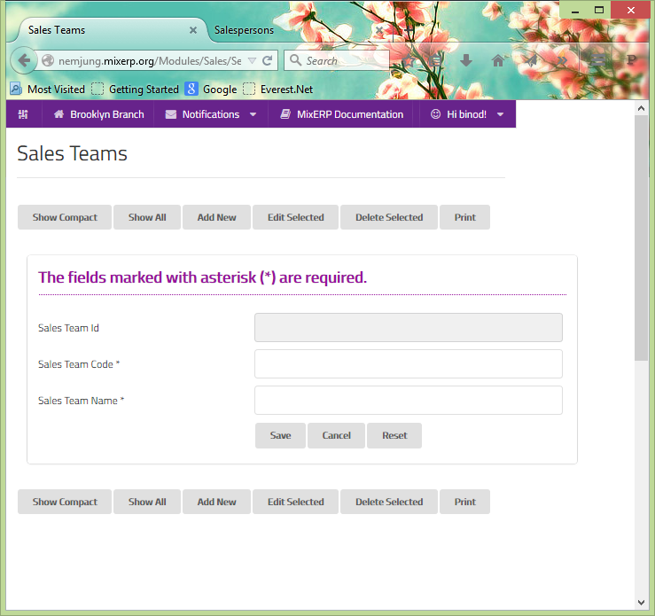

#Sales Teams
It is a group of salespersons who are involved in sales of one or
more product of an organization.

##Fields

**Sales Team Id**

This is an auto-generated and read-only field.

**Sales Team Code**

Provide a unique code for the sales team.

**Sales Team Name**

Provide a name for the sales team.

    Since this form implements ScrudFactory helper module, the detailed explanation of this feature is not provided
    in this document. View <a href="../../core-concepts/scrud-factory.md">ScrudFactory Helper Module Documentation</a>
    for more information.

##Related Topics
* [Setup and Maintenance](../setup-and-maintenance.md)
