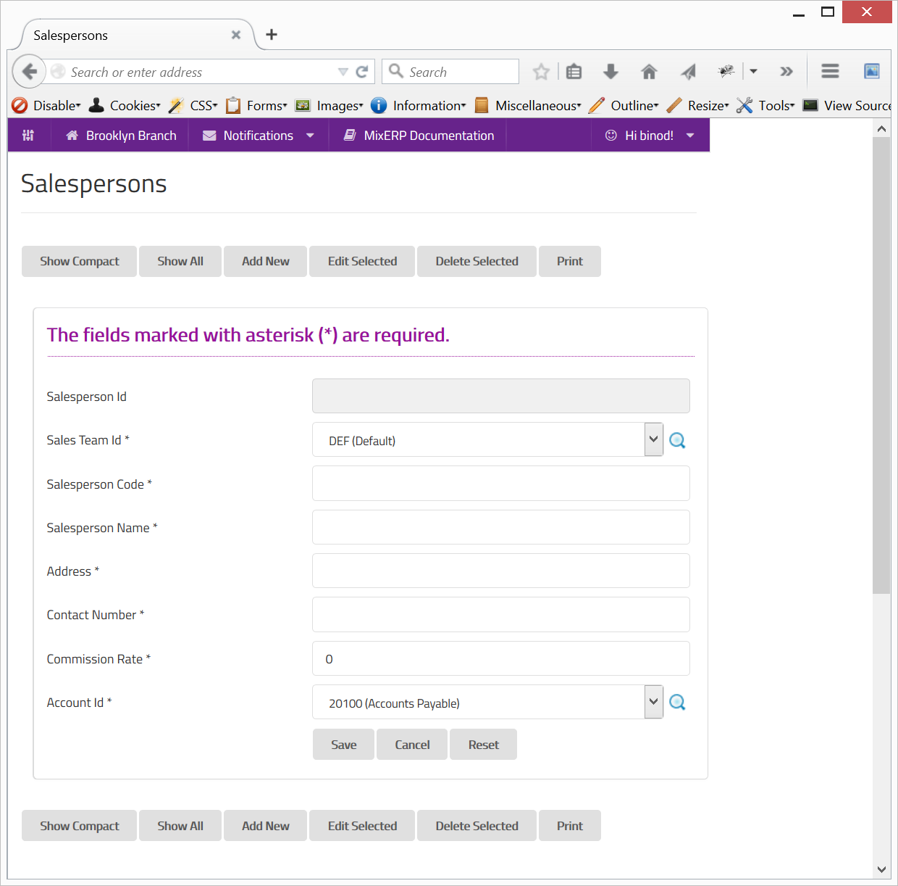

#Salespersons

Salesperson is an individual who markets and sells products of your office, 
individually or together with a [team](sales-team.md).
The success of a salesperson is usually measured by the amount of sales he or she is able to make during a given period 
and how good that person is in influencing individuals to make a purchase order. 

##Fields

**Salesperson Id**

This is an auto-generated and read-only field.

**Sales Team Id**

Select the sales team or search by clicking the icon <i class="item-selector"></i>.

**Salesperson Code**

Provide a unique code for the salesperson.

**Salesperson Name**

Provide the name of the salesperson.

**Address**

Provide the address of the salesperson.

**Contact Number**

Provide contact number information.

**Account Id**

Select the account to map the sales person to or search by clicking the item-selector icon<i class="item-selector"></i>.

    Since this form implements ScrudFactory helper module, the detailed explanation of this feature is not provided
    in this document. View <a href="../../core-concepts/scrud-factory.md">ScrudFactory Helper Module Documentation</a>
    for more information.

##Related Topics
* [Setup and Maintenance](../setup-and-maintenance.md)
