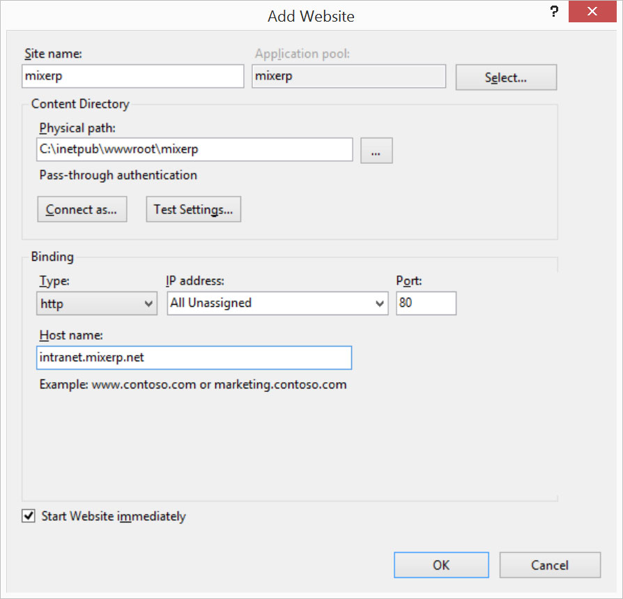
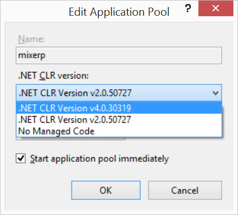
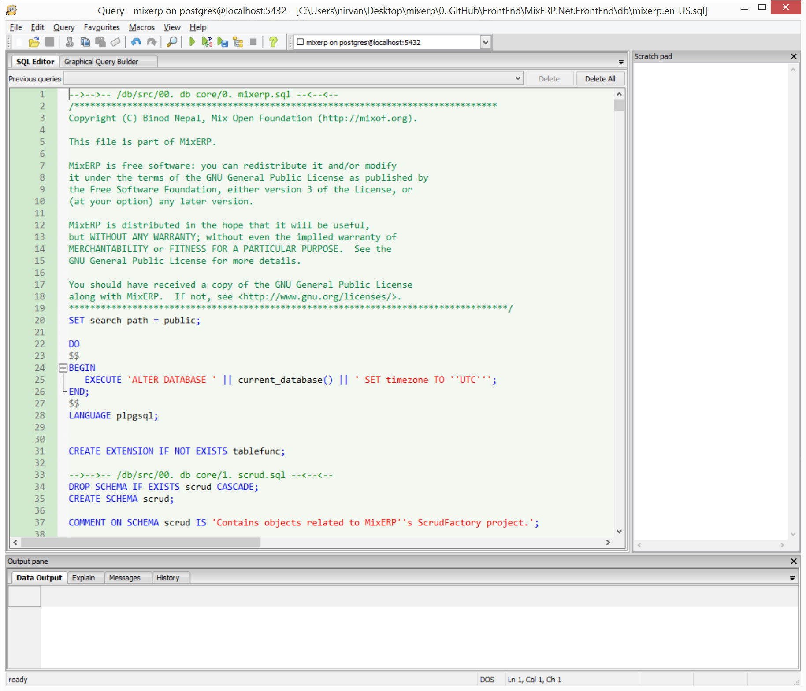

#Deploying MixERP on IIS

This document provides you relevant information regarding MixERP deployment and guides system administrators to properly setup MixERP 
in your organization.

##Publish MixERP

Skip this section if you already got MixERP publish package from our delivery channel.

* [Clone MixERP](../../clone-mixerp)
* Open MixERP in Microsoft Visual Studio Express.
* Publish using MixERP Publish Profile in Visual Studio Express to your desired location.

##Copy Published Directory to Application Server 
This document assumes that MixERP application root directory is 

C:\inetpub\wwwroot\mixerp\
* Create a directory "mixerp" under "C:\inetpub\wwwroot\".
* Copy all the contents under the published directory to the application root.

##Create IIS Website

To create MixERP website in IIS, navigate to the "Sites" container.

Right click "Sites" and click "Add Website"

Now enter the following details:

<table>
<tr>
    <th>
        Section
    </th>
    <th>
        Description
    </th>
</tr>
<tr>
    <td>
        Site Name
    </td>
    <td>
        The name of your MixERP Application, usually "mixerp".
    </td>
</tr>
<tr>
    <td>
        Application Pool
    </td>
    <td>
        A new application pool will be created if you do not select an already existing application pool. Do not select this.
    </td>
</tr>
<tr>
    <td>
        Physical Path
    </td>
    <td>
        The physical path where you copied the published directory to. In this document, it is  
        
C:\inetpub\wwwroot\mixerp

    </td>
</tr>
<tr>
    <td>
        Binding Type
    </td>
    <td>
        The binding type should be "https" and SSL certificate should be chosen. If you do not have SSL certificate, select "http".
    </td>
</tr>
<tr>
    <td>
        Binding IP Address
    </td>
    <td>
        Select "All Unassigned" unless you want to bind your MixERP Application to a specific IP Address.
    </td>
</tr>
<tr>
    <td>
        Binding Port
    </td>
    <td>
        Select "80" for port number unless you want to change the port binding of your MixERP Application to an unusual number.
    </td>
</tr>
<tr>
    <td>
        Binding Host Name
    </td>
    <td>
        If you have your DNS requests forwarded to your Application Server, put that in the host name section.
        If you leave this blank, you will have to access MixERP application using the Application Server IP Address or Network name. 
    </td>
</tr>
</table>

##Target App Pool .net Version
Once you are done creating the website, navigate to the "Application Pools" container in IIS. Find and double click 
the application pool "mixerp".

Change the ".NET Framework Version" or ".NET CLR version" to "V.4.0.3019".

Done!

##Setting up Directory Permission
The following directories should be writable to the user account used by IIS for MixERP website. Depending upon the version of your IIS 
and Windows, it will be one of the following users:

* IIS_USRS
* Network Service
* IIS AppPool\mixerp

**Directories**
<table>
    <tr>
        <th style="min-width:380px;">
            Directory
        </th>
        <th>
            Description
        </th>
    </tr>
    <tr>
        <td>
            C:\mixerp-published\Resource\Temp
        </td>
        <td>
            MixERP uses this directory to temporarily save documents and images. It is absolutely safe to remove 
            the files under this directory.
        </td>
    </tr>
    <tr>
        <td>
            C:\mixerp-published\Resource\Temp\Images
        </td>
        <td>
            This directory is also used to temporarily save image files. It is safe to remove files under this directory. 
        </td>
    </tr>
    <tr>
        <td>
            C:\mixerp-published\Resource\Static\Attachments
        </td>
        <td>
            This directory is used as a file-system repository of document attachments. You should not delete anything inside this directory.
        </td>
    </tr>
    <tr>
        <td>
            C:\mixerp-published\Resource\Static\Emails
        </td>
        <td>
            This directory contains emails and is used as pickup directory for SMTP Server. 
        </td>
    </tr>
</table>

##Install PostgreSQL Server

Follow the guidelines in this article on how to install PostgreSQL Server on your Windows machine. [Click Here](install-postgresql)

##Compile MixERP Database

Once you complete installing PostgreSQL Server in your Application Server, run the PostgreSQL GUI tool "PgAdmin". 
Connect to the PostgerSQL Server by using your credentials.

    Select "Databases" --> Click Edit --> New Object --> New Database --> Type "mixerp" and hit RETURN key.
    

    Select "mixerp" database --> Click Tools --> Query Tool

Now open the MixERP SQL Script from this location:

    C:\inetpub\wwwroot\mixerp\db\mixerp.en-US.sql
    
or your language specific SQL Script.

Press F5.

##Securing Your PostgreSQL Database

Securing your installation is out of the scope of this article. However, keep in mind that  MixERP creates the following database roles:

* mix_erp
* report_user

**mix_erp**
* change the password of this role. For more information, [click here](http://www.postgresql.org/docs/9.0/static/sql-alterrole.html)
* is used to perform SCRUD operations on the database

**report_user**
* the user used by MixERP ReportEngine Application for performing ad-hoc queries.
* this user **must have a readonly access** on the database.

Use these articles as a reference to secure your PostgreSQL installation:
* http://www.ibm.com/developerworks/library/os-postgresecurity/
* http://www.depesz.com/2007/08/18/securing-your-postgresql-database/
* http://www.mad-hacking.net/documentation/linux/applications/postgres/connection-permissions.xml
* http://dbaportal.eu/2013/11/11/securing-postgresql/

##Web Configuration File
Edit these appsettings key in the root web.config file:

<table class="ui celled table segment">
    <tr>
        <th>Key</th>
        <th>Default Value</th>
        <th>Description</th>
    </tr>
    <tr>
        <td>
            Server
        </td>
        <td>
            localhost
        </td>
        <td>
            The NetBIOS name or IP Address of computer where database server (PostgreSQL) is installed. 
        </td>
    </tr>
    <tr>
        <td>
            Database
        </td>
        <td>
            mixerp
        </td>
        <td>
            The name of database which contains MixERP schemas and objects.
        </td>
    </tr>
    <tr>
        <td>
            User Id
        </td>
        <td>
            mix_erp
        </td>
        <td>
            The PostgreSQL role created by MixERP DB Script. 
        </td>
    </tr>
    <tr>
        <td>
            Password
        </td>
        <td>
            change-on-deployment
        </td>
        <td>
            The password for mix_erp PostgreSQL role.
        </td>
    </tr>
</table>

##MixERP Configuration Files:
MixERP provides a highly parameterized design, so that you can parameterize almost everything:

<table class="ui celled table segement">
    <tr>
        <th style="min-width:550px;">
            Configuration File Location
        </th>
        <th>
            Description
        </th>
    </tr>
    <tr>
        <td>
            C:\inetpub\wwwroot\mixerp\Resource\Configuration\DbParameters.xml
        </td>
        <td>
            This configuration file provides overrides to use column expressions as "DisplayFields" for your primary key lookups and other parameters.
        </td>
    </tr>
    <tr>
        <td>
            C:\inetpub\wwwroot\mixerp\Resource\Configuration\MessagingParameters.xml
        </td>
        <td>
            This configuration file provides overrides to Email credentials and other parameters.
        </td>
    </tr>
    <tr>
        <td>
            C:\inetpub\wwwroot\mixerp\Resource\Configuration\PartyControlParameters.xml
        </td>
        <td>
            This configuration file provides parameter overrides related to PartyControl.         
        </td>
    </tr>
    <tr>
        <td>
            C:\inetpub\wwwroot\mixerp\Resource\Configuration\ReportParameters.xml
        </td>
        <td>
            This configuration file provides parameter overrides related to PartyControl.
        </td>
    </tr>
    <tr>
        <td>
            C:\inetpub\wwwroot\mixerp\Resource\Configuration\ScrudParameters.xml
        
        </td>
        <td>
            This configuration file provides parameter overrides related to ScrudFactory.
        </td>
    </tr>
    <tr>
        <td>
            C:\inetpub\wwwroot\mixerp\Resource\Configuration\Switches.xml
        
        </td>
        <td>
            This configuration file provides overrides for various application level switches.
        
        </td>
    </tr>
    <tr>
        <td>
            C:\inetpub\wwwroot\mixerp\Resource\Configuration\TransactionChecklistParameters.xml
        
        </td>
        <td>
            This configuration file provides parameter overrides related to TransactionChecklist.
        </td>
    </tr>
</table>

    This article is likely to become outdated for future releases.

##Related Topics
* [Deployment Documentation](index.md)
