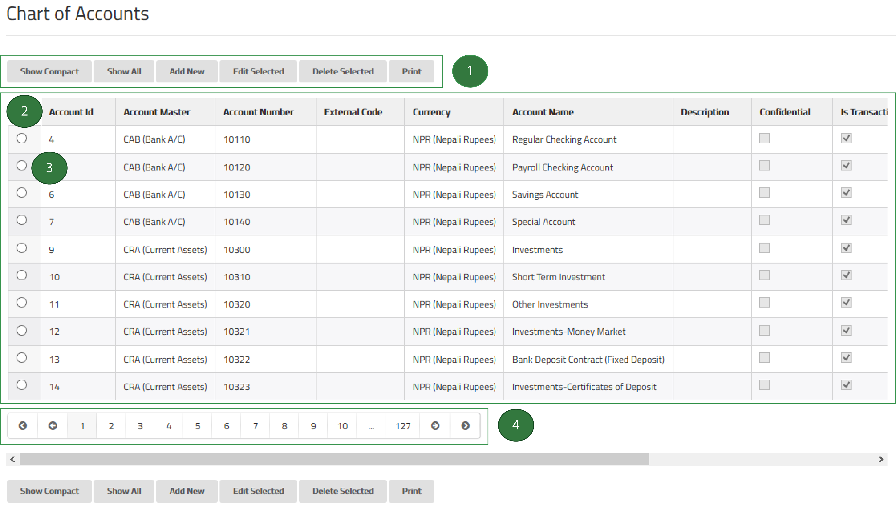

#ScrudFactory

ScrudFactory is one of the various core modules of MixERP which facilitates rapid application development (RAD). ScrudFactory provides a common and consistent user interface, which helps you efficiently get you job done.

#View Panel

The view panel consists of:

* Command Buttons
* GridView
* Selectors
* Pager

##1. Command Buttons

<table>
    <thead>
        <tr>
            <th>Button</th>
            <th>Description</th>
        </tr>
    </thead>
    <tbody>
        <tr>
            <td>Show Compact</td>
            <td>Displays the compact view and resets the page to 1.</td>
        </tr>
        <tr>
            <td>Show All</td>
            <td>
                Displays an expanded view and resets the page to 1.
                 
                 
                **Warning**: If your entity is a huge table, MixERP will only
                display 1000 rows with paging.
            </td>
        </tr>
        <tr>
            <td>Add New</td>
            <td>Displays a form to add a new record.</td>
        </tr>
        <tr>
            <td>Edit Selected</td>
            <td>Displays a form with the selected record for editing. See **selectors** below.</td>
        </tr>
        <tr>
            <td>Delete Selected</td>
            <td>Deletes the selected record. See **selectors** below.</td>
        </tr>
        <tr>
            <td>Print</td>
            <td>Opens up a popup window with a printer-friendly view of the current grid.</td>
        </tr>
    </tbody>
</table>

##2. GridView
The ScrudFactory grid displays information about an entity. In this example, [chart of accounts](../sales/setup/coa.md) is displayed. MixERP Scrud grid, by default, has the following behavior:

* The rows are sorted by the key column.
* The rows are paged by the size of 10.
* The default grid page size of 10 is also known as a **compact view**.

##3. Selectors

The first column of each row is a selector with a radio button. You can click anywhere on a row to turn the selection on.
Similarly, clicking another row will toggle your selection from previous row to a new one, resulting in only one row being
**"selectable"**. Once you select the record you're interested in, you can then perform some other tasks
such as editing or deleting the entry.

    MixERP will keep an audit trail of the user performing the Scrud operation.

##4. Pager
The application user might not be interested to view all records at once. This would be somewhat irrelevant, confusing, and even boring.
On the other hand, displaying a huge chunk of information would also be a resource-intensive task. That is the reason
why the records are sorted and arranged in pages.

##Form View

The form view provides you a form panel to work with--presenting a collection of fields.

| Type                  | Description |
|-----------------------|-------------|
| Text Field            | Allows you to enter text. |
| Number Field          | Enter a valid number, generally a positive number. |
| Radio Buttons         | Allows you to select an item from the group of radio buttons. |
| Date Field            | Enter a valid date value or select a date from date-picker control. |
| Select Field          | Allows you to select an item from the drop-down list control. |
| Selector Icon         | See item selector below. |

Remember that when a field is marked with a star (\*), it means that you cannot leave it empty. Similarly, some fields
may validate values to have standard and recognizable formats, including but not limited to, the following :

* whole numbers
* decimal numbers
* dates/times
* phone numbers
* zip codes
* others

As soon as you enter all required and relevant fields, you are good to go.
Click **Save** to add the new record. For whatever reason you want **not to save**
the entry, click **Cancel**. Similarly click **Reset** to reset the form fields to their original state.

    When you are adding a new record and then resetting, the form fields will generally fall back to
    an empty or the default value. Editing a form and then resetting, on the other hand, would reset the fields to the existing
    value(s) they were initialized with.

##Item Selector

Item selector allows you to quickly find the item you are looking for by displaying a modal window. In the modal window,
you can filter records by performing a [wildcard search operation](wildcard-search.md).

When you find the item you were looking for, click on the associated link **Select**. Clicking the link will close the
item selector window and update the associated control with the value you selected.

#Shortcuts

| Key Combination    | Action |
|--------------------|-------|
| CTRL + SHIFT + C   | Show Compact |
| CTRL + SHIFT + S   | Show All |
| CTRL + SHIFT + A   | Add New |
| CTRL + SHIFT + E   | Edit Selected |
| CTRL + SHIFT + D   | Deleted Selected |
| CTRL + SHIFT + P   | Print |
| ESC                | Cancel |

##Related Topics
* [MixERP User Guide](../index.md)